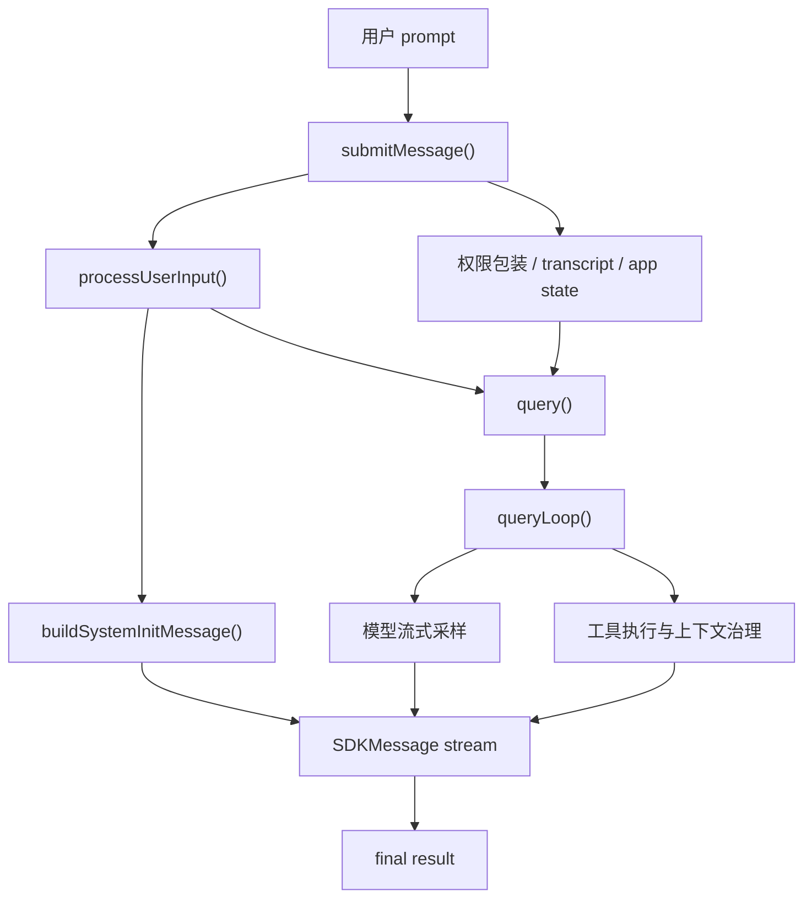
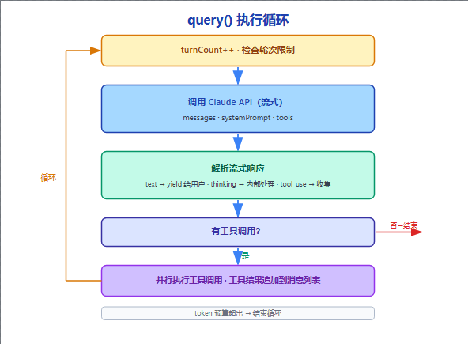
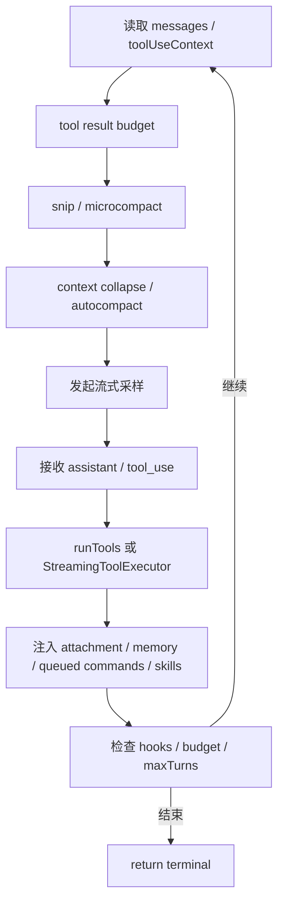

## 0-A/ 

​	第一次打开 Claude Code 的核心实现，一个很容易冒出来的问题是：为什么它没有把整个流程都塞进一个大而全的 `ask()`，而是拆成了 `QueryEngine`、`submitMessage()`、`query()`、`queryLoop()` 这几层？继续往下看会发现，这不是代码风格偏好，而是它对 Agent 复杂度的一次明确分层。Claude Code 要处理的从来不只是“把 prompt 发给模型”，而是把一次输入变成一段可持续推进、可记录、可恢复、可治理的会话，再把这段会话交给一个会不断再入的执行循环。

所以本文的阅读脉络固定为：`QueryEngineConfig` -> `QueryEngine` -> `submitMessage()` -> `processUserInput()` / transcript / system init -> `query()` -> `queryLoop()` -> `runTools()` / `StreamingToolExecutor`

这样写有两个好处。第一，顺着代码看，不会失去“我是怎么从上层走到底层”的感觉。第二，每走到一个关键节点不是去讲 TypeScript 语法，而是思考：这一段在系统里到底承接了什么复杂度。

“By the way, the Claude Code source code was analyzed using OpenAI ChatGPT.”

## 1. 从 QueryEngineConfig 到 QueryEngine：先看到的是会话容器

顺着 `src/QueryEngine.ts` 往下看，最先遇到的不是模型调用，而是 `QueryEngineConfig` 和 `QueryEngine` 本身。这个起手式已经说明了一件事：Claude Code 想解决的不是一个孤立请求，而是“如何把一段 conversation 组织成真实存在的运行对象”。

```ts
// src/QueryEngine.ts
export type QueryEngineConfig = {
  cwd: string                          // 工作目录
  tools: Tools                         // 可用工具集
  commands: Command[]                  // 可用斜杠命令
  mcpClients: MCPServerConnection[]    // MCP 服务器连接
  agents: AgentDefinition[]            // 代理定义
  canUseTool: CanUseToolFn             // 权限检查函数
  getAppState: () => AppState          // 读取全局状态
  setAppState: (f) => void             // 更新全局状态
  initialMessages?: Message[]          // 初始消息（用于恢复会话）
  readFileCache: FileStateCache        // 文件读取缓存
  customSystemPrompt?: string          // 自定义系统提示
  appendSystemPrompt?: string          // 追加系统提示
  userSpecifiedModel?: string          // 用户指定模型
  maxTurns?: number                    // 最大轮次限制
  maxBudgetUsd?: number                // 最大费用限制（美元）
  taskBudget?: { total: number }       // token 预算
  jsonSchema?: Record<string, unknown> // 结构化输出 schema
  handleElicitation?: ...              // MCP 权限请求处理
}
class QueryEngine {
  private config: QueryEngineConfig
  private mutableMessages: Message[]           // 消息历史（可变）
  private abortController: AbortController     // 中断控制器
  private permissionDenials: SDKPermissionDenial[]  // 权限拒绝记录
  private totalUsage: NonNullableUsage         // 累计 token 使用量
  private discoveredSkillNames = new Set<string>()  // 已发现的 Skills
  private loadedNestedMemoryPaths = new Set<string>() // 已加载的 Memory 路径
}
```

`QueryEngineConfig` 不是“请求参数表”，而是一次会话依赖的装配入口。它把工作目录、工具、slash command、MCP 客户端、agents、权限判定、AppState 读写、文件缓存这些跨度很大的依赖一次性装进来，说明 `QueryEngine` 面向的不是“问模型一个问题”，而是“把整个会话运行面准备齐”。

为什么这里会同时出现 `tools`、`commands`、`mcpClients`、`agents`、`getAppState`、`readFileCache` 这种看起来不属于同一层的东西？因为 Claude Code 的一次会话不是纯文本对话，它要同时接住：

- 模型可用能力：有哪些工具、哪些命令、哪些 agent
- 外部运行状态：当前工作目录、权限模式、fast mode、file history
- 会话恢复与缓存：初始消息、文件读取状态、记忆加载状态

这就决定了它不能只在请求发出前临时拼一个参数对象。它必须先有一个 conversation-scoped orchestrator，把这些依赖和状态挂在一起，后续每一轮都围绕同一个运行对象推进。

接着看类成员，结论会更清楚。`mutableMessages`、`permissionDenials`、`totalUsage`、`loadedNestedMemoryPaths` 都不是“这次调用里临时算一下就扔”的变量，而是整个会话生命周期都要持续累积的状态。

- `mutableMessages` 是历史消息的真实存储，不只是当前 prompt 的包装壳。
- `permissionDenials` 会跨轮累计，最后在结果里回传给 SDK 调用方。
- `totalUsage` 记录累计消耗，说明预算治理不是单轮行为。
- `loadedNestedMemoryPaths` 这种状态存在，说明系统还要关心“哪些记忆已经被加载过”，避免重复注入。

这一层最值得记住的判断是：`QueryEngine` 持有的不是调用参数，而是会话状态。

## 2. 顺着进入 submitMessage()：一次输入如何被装配成会话

当 `QueryEngine` 这个会话容器立住以后，真正的入口是 `submitMessage()`。这个函数很长，但阅读时最好不要一开始就陷进每个变量名里，而是先把它看成一条“把用户输入翻译成 SDK 事件流”的装配流水线。

```ts
async *submitMessage(
  prompt: string | ContentBlockParam[],
  options?: { uuid?: string; isMeta?: boolean },
): AsyncGenerator<SDKMessage, void, unknown> {
  const { cwd, commands, tools, mcpClients, maxTurns, taskBudget } = this.config
  const wrappedCanUseTool: CanUseToolFn = async (...) => { ... }
  const { defaultSystemPrompt, userContext, systemContext } =
    await fetchSystemPromptParts(...)
  const { messages: messagesFromUserInput, shouldQuery, model } =
    await processUserInput(...)
  this.mutableMessages.push(...messagesFromUserInput)
  yield buildSystemInitMessage(...)
  for await (const message of query({ ... })) {
    ...
  }
}
```

`submitMessage()` 是一个异步生成器，但真正重要的不是语法，而是控制方式。它不会一次性 `return` 一个结果，而是持续 `yield` 出 `SDKMessage`。这意味着在 Claude Code 里，一次输入不是“调用然后等待”，而是“启动一条会话事件流”。

按阅读顺序往下看，它大致会做六件事。

第一件事，是初始化当前 turn 的运行环境。这里会从 `this.config` 中拆出 `cwd`、工具、命令、模型限制、预算限制这些配置，清空本轮 skill 发现状态，设置工作目录，并记录开始时间。先解决的不是“问什么”，而是“这次会话在什么环境里运行”。

第二件事，是把权限检查包一层。`canUseTool` 原本只是“判断能不能调用工具”的函数，但 `submitMessage()` 不直接透传给下游，而是包成 `wrappedCanUseTool`：如果工具被拒绝，就把拒绝记录进 `permissionDenials`。这说明权限系统在 Claude Code 里不是临时弹窗，而是会话审计的一部分。


第三件事，是确定本轮的模型与提示词环境。这里会先拿到 `initialAppState`，再确定这次的 `mainLoopModel` 与 `thinkingConfig`，然后通过 `fetchSystemPromptParts(...)` 获取三类材料：

- `defaultSystemPrompt`
- `userContext`
- `systemContext`

这些名字乍看像“准备 prompt”，但本质上是在准备会话运行的制度环境。工具、MCP 客户端、额外工作目录、custom prompt、memory mechanics prompt、appendSystemPrompt 都会在这一层被合并进去。Claude Code 不是在临门一脚把一段 prompt 拼出来，而是在模型调用前先把“这次对话所处的世界”组织出来。


第四件事，是构造 `processUserInputContext`。这是一个非常关键、也很容易被忽略的对象。它不是普通参数包，而是“处理用户输入时可用的整套上下文工具箱”。里面除了消息列表和工具/命令集合，还放进了：

- `getAppState` / `setAppState`
- `abortController`
- `readFileState`
- `loadedNestedMemoryPaths`
- `discoveredSkillNames`
- file history / attribution 的更新函数
- `setSDKStatus`

这说明 `processUserInput()` 从来不只是把字符串解析一下。它有权修改消息列表、更新权限规则、影响文件历史、归因状态、skill 发现与记忆加载。换句话说，这一步不是“输入预处理”那么轻，而是一次真实的会话前置协调。

第五件事，是处理 orphaned permission。如果会话曾经因为权限请求卡住，进程又发生了中断、重启或恢复，那么新一轮 `submitMessage()` 进入时，系统不会假装之前什么都没发生，而是先把悬空的权限状态处理掉，再继续走下面的输入路径。

第六件事，才是调用 `processUserInput()`。也就是说，在 Claude Code 里，“用户发来了一句话”根本不是一个可以直接扔给模型的东西。系统必须先准备环境、权限、上下文和恢复状态，然后才轮到解析输入本身。

`processUserInput()` 的返回值也很能说明问题：

- `messagesFromUserInput`
- `shouldQuery`
- `allowedTools`
- `modelFromUserInput`
- `resultText`

这几个值合起来说明它在做的不是语法分析，而是“决定这次输入到底要走哪条执行路径”。有的输入只是普通 prompt，有的是 slash command，有的会改变允许工具列表，有的会切换模型，有的甚至根本不该进入模型，而应该在本地路径里就地消化掉。

当这一步结束后，`submitMessage()` 才会把新产生的消息推入 `this.mutableMessages`。这意味着从系统内部视角看，用户输入一旦被接受，就已经成为会话历史的一部分。

## 3. 还没问模型前，为什么已经做了这么多工程动作

很多人第一次读到这里会觉得奇怪：模型还没开始采样，为什么 `submitMessage()` 已经在做 transcript、权限上下文、plugin/skill 加载、system init message 这些偏工程的事情？原因很简单：Claude Code 清楚知道 Agent 的复杂度大头并不只在模型 API 上。

这里最值得先看的，是 transcript 的写入时机。源码明确把用户消息的持久化放在进入 query loop 之前。原因非常现实：如果用户消息刚被接受，进程就在 API 响应回来前被杀掉，那么如果 transcript 还没写下去，`resume` 时看到的就会像“这段对话没有真正开始过”。所以 Claude Code 的策略是，一旦用户输入被系统接收，就先写入 transcript，保证这段会话至少从“消息已被接受”的时刻开始可恢复。

这一步背后体现的是一个很关键的判断：Agent 系统不是只有“成功跑到底”一种状态。用户会中断、会崩、会重启、会 resume。要让这些动作成立，最先要守住的不是模型输出，而是会话事实本身。

接着是 `setAppState(...)` 对工具权限上下文的回写。`processUserInput()` 可能根据用户输入更新 allowed tools，`submitMessage()` 随后就把这些变化同步回全局 `toolPermissionContext`。这说明权限在 Claude Code 里不是“一次弹窗就结束”的孤立机制，而是整个会话状态的一部分。

然后才轮到 `buildSystemInitMessage()`。这一步也很能说明 `SDKMessage` 的定位。系统在正式进入模型前，就先 `yield` 出一条 `system/init` 消息，把这一轮会话公开的运行边界告诉外部：

- 当前模型是什么
- 当前 permission mode 是什么
- 有哪些工具、命令、agents、skills、plugins
- fast mode 的状态是什么

对外部调用方而言，会话不是从第一句 assistant 回复才开始的，而是从“系统完成初始化并公开运行边界”这一刻就开始了。



这时候 `shouldQuery` 的意义就非常清楚了。它不是一个普通布尔开关，而是在问：这次输入是否真的应该进入模型主循环？如果答案是否，那么 Claude Code 会直接走本地快速通道：把本地命令的输出回放出来，补上一条 `result` 消息，然后结束本次提交。也就是说，在 Claude Code 里，“一次提交”并不天然等于“一次模型调用”。

```ts
for await (const message of query({
  messages,
  systemPrompt,
  userContext,
  systemContext,
  canUseTool: wrappedCanUseTool,
  toolUseContext: processUserInputContext,
  fallbackModel,
  querySource: 'sdk',
  maxTurns,
  taskBudget,
})) {
  ...
}
```

这一段是整条调用链的下潜时刻。前面所有准备动作，都是为了把一个“已经具备上下文、权限、恢复能力和状态边界的会话快照”交给 `query()`。从这里开始，上层编排暂时退后，下面真正进入 Agent 执行循环。


还要特别注意一点：即使到了整个 `submitMessage()` 的末尾，最终结果也仍然不是通过 `return` 返回给调用方，而是通过 `yield { type: 'result', ... }` 作为事件流中的最后一条消息发出去。这说明最终结果不是脱离过程的特殊出口，而是统一事件协议的一部分。

## 4. 从 query() 到 queryLoop()：控制权如何下沉到执行循环

顺着 `query()` 再往下看，就正式从 `src/QueryEngine.ts` 走进了 `src/query.ts`。这一跳看似只是“换了个文件”，其实正是 Claude Code 最重要的边界切换：前面一直在做会话装配，这里开始进入执行推进。

```ts
export async function* query(
  params: QueryParams,
): AsyncGenerator<StreamEvent | Message, Terminal> {
  const consumedCommandUuids: string[] = []
  const terminal = yield* queryLoop(params, consumedCommandUuids)
  for (const uuid of consumedCommandUuids) {
    notifyCommandLifecycle(uuid, 'completed')
  }
  return terminal
}

async function* queryLoop(
  params: QueryParams,
  consumedCommandUuids: string[],
): AsyncGenerator<StreamEvent | Message, Terminal> {
  ...
}
```

query()` 的职责很收敛。它不真正推进模型和工具，而是把控制权转发给 `queryLoop()`，同时在正常结束后补做生命周期尾声，比如把已经消费的 queued command 标记为 completed，并把最终的 terminal 状态向上返回。

这层包装器的存在很有价值。因为一旦系统要处理的不是一次简单采样，而是“可能跨多轮、会消费队列命令、会被中断、会返回多种终止理由”的执行循环，那么“对内推进逻辑”和“对外生命周期补尾”就最好分开。`query()` 负责让外部入口稳定，`queryLoop()` 负责让内部循环自由生长。

所以从阅读脉络上，可以在这里明确划一条线：

- `submitMessage()` 解决的是：如何把一次输入装配成一个可运行的会话
- `queryLoop()` 解决的是：如何把这个会话推进到结束

前者是会话编排，后者是执行循环。



## 5. 顺着读 queryLoop：Claude Code 的 Agent 循环到底在推进什么

`queryLoop()` 最醒目的特征是 `while (true)`。但如果只把它理解成“循环发请求”，就会低估这段代码的意义。更准确地说，它是一个跨轮状态推进器：每一轮都从当前消息历史与工具上下文出发，重新建构本轮 query 视图，再决定接下来是采样、压缩、执行工具、恢复、续跑，还是直接终止。



```ts
while (true) {
  let { toolUseContext } = state
  const { messages, autoCompactTracking, turnCount } = state
  let messagesForQuery = [...getMessagesAfterCompactBoundary(messages)]

  messagesForQuery = await applyToolResultBudget(...)
  const snipResult = snipCompactIfNeeded(...)
  const microcompactResult = await deps.microcompact(...)
  const collapseResult = await applyCollapsesIfNeeded(...)
  const { compactionResult } = await deps.autocompact(...)

  yield { type: 'stream_request_start' }
  // stream model output, collect assistant/tool_use
  // run tools, inject attachments, check budgets/hooks
  // continue next turn or return
}
```

这段骨架里最重要的，不是 `while (true)` 这个语法点，而是“每一轮都从状态重新建构本轮视图”的模式。Claude Code 不是拿一段固定 prompt 不断重复调用模型，而是在不断重算“此刻应该给模型看什么”“哪些结果该保留”“哪些历史该压缩”“本轮是否还能继续”。

这一段先做的事情，是状态准备。`queryLoop()` 从 `state` 中取出 `messages`、`toolUseContext`、`autoCompactTracking`、`turnCount` 等跨轮状态，再生成 `messagesForQuery`。注意它不是直接拿整个历史消息去问模型，而是先用 `getMessagesAfterCompactBoundary(messages)` 做边界裁切。这说明“给模型看的上下文”和“本地会话历史”已经不是同一个概念。

接下来的上下文治理链路，是 Claude Code 最有 Agent 味道的一段。它不是“上下文长了就截断”这么简单，而是一层层处理：

- `applyToolResultBudget(...)`：先控制工具结果过大带来的上下文污染。
- `snip`：做更轻量的历史裁剪，尽量在不破坏主线的情况下先释放一部分空间。
- `microcompact`：对局部片段做更细粒度压缩。
- context collapse：把某些历史折叠成一种投影视图，而不是立刻粗暴地删掉。
- `autocompact`：在必要时生成真正的紧凑摘要，把会话推进到新的紧凑边界。

这条链路特别值得记住，因为它说明 Claude Code 处理上下文不是靠一个单点机制，而是分层治理。不同层的方法解决的不是同一个问题：有的是轻量缓冲，有的是局部压缩，有的是投影式折叠，有的是全局摘要。

当这些治理动作完成后，循环才发出 `stream_request_start` 并准备真正采样。这里还会为当前 query 生成 `queryTracking`，记录 chainId 和 depth。也就是说，Claude Code 连“这已经是第几层递进查询”都显式地建模出来了。

进入流式采样以后，`queryLoop()` 会同时维护几类东西：`assistantMessages`、`toolUseBlocks`、`toolResults`，以及当前是否需要 follow-up。这里一个很关键的设计判断是：在 Claude Code 里，assistant 的 `tool_use` 不是“回复里的一个小插曲”，而是决定本轮是否要继续递归推进的核心信号。

错误恢复也被放在循环体里，而不是外围兜底里。它说明 Claude Code 把失败当成循环中的一种正常转移，而不是例外。比如：

- prompt 太长时，会尝试 context collapse 的 overflow recovery，再尝试 reactive compact
- 遇到 `max_output_tokens`，会先提升上限或注入恢复消息，推动下一轮继续
- 模型本身触发 fallback 时，会清理不一致状态，再切到 fallback model 重试

这类逻辑的共同点是：系统默认不把错误当成“就地结束”的信号，而是尽量把会话带回一个还能继续推进的状态。

## 6. 工具执行为什么不是旁路，而是主循环的一部分

如果顺着 `queryLoop()` 继续往下读，最值得专门停一下的地方就是工具执行。很多系统会把 tool use 理解成“模型说要用工具，那就去跑一下”，但 Claude Code 并不是这么设计的。它把工具调用视为会话推进的正式组成部分：工具执行会影响消息历史、上下文视图、预算、恢复路径和后续递归。

```ts
const toolUpdates = streamingToolExecutor
  ? streamingToolExecutor.getRemainingResults()
  : runTools(toolUseBlocks, assistantMessages, canUseTool, toolUseContext)

for await (const update of toolUpdates) {
  if (update.message) {
    yield update.message
    toolResults.push(...normalizeMessagesForAPI([update.message], ...))
  }
  if (update.newContext) {
    updatedToolUseContext = { ...update.newContext, queryTracking }
  }
}
```

这一段代码在做的事情可以概括成一句话：把 assistant 的 `tool_use` 推进成后续轮次能消费的 `tool_result`，同时把工具带来的上下文变化纳入主循环状态。这里不是“跑一下工具再回来”，而是“把工具执行也放进事件流和状态机里”。

这里有两条路径。第一条是 `runTools()`，它是工具批次执行器。它会先按并发安全性划分工具批次：只读、并发安全的工具可以并行跑；会改状态、会互相干扰的工具则要串行执行。

第二条是 `StreamingToolExecutor`。它更进一步，把工具执行也做成流式的。这样做的好处是，工具进度消息和最终结果能尽量贴着当前 assistant 流往外送，而不会出现明显的时序脱节。更重要的是，它还能在 fallback 或中断场景下 `discard()` 未完成的旧结果，避免旧 `tool_use_id` 对应的残留结果混进新的回复路径里。

这正是 Agent 系统和普通聊天工具最容易拉开差距的地方：不是能不能调用工具，而是能不能让工具调用和消息流、上下文状态、恢复逻辑保持一致。工具执行完以后，`queryLoop()` 并不会立刻回到模型，而是还要继续注入一系列 attachment：

- queued commands
- memory attachments
- skill discovery attachments
- 文件修改相关 attachment

为什么这些东西放在工具结果之后？源码里有一句非常关键的注释：API 不允许把普通 user 消息和 `tool_result` 随意交错。因此系统必须先把本轮 tool results 处理完，再把附件、记忆和队列消息以合适顺序补进去。

这一段还暴露出 Claude Code 的另一个特点：工具执行并不只返回文本结果，它还会改变后续会话可见的世界。文件被编辑了、记忆被发现了、后台任务完成了、skills 被预取出来了，这些都要在下一轮进入模型之前作为新的 attachment 或上下文线索补回去。

中断处理也说明了这一点。如果用户在工具执行中途终止会话，系统仍然会尽量补齐中断消息、合成必要的结果或 attachment，并检查 `maxTurns` 是否已经触发。只要 assistant 已经发出了 `tool_use`，系统就必须努力把这段历史收束成一致状态。

最后，循环还会在本轮结束前统一检查：

- stop hooks 是否阻止继续
- token budget 是否已达边界
- `maxTurns` 是否到达
- 是否需要生成 tool use summary
- 是否要刷新工具集合

如果还可以继续，它就把 `messagesForQuery + assistantMessages + toolResults` 组装成新的 `state.messages`，再带着更新后的 `toolUseContext` 进入下一轮。直到这里，Claude Code 的 Agent loop 才真正闭合起来。

## 7. OpenAI 小结

顺着这条调用链走完，再回头看，会更容易理解 Claude Code 真正在处理的复杂度。它不是在“发一次 prompt”，而是在维护一个跨轮会话状态机。`QueryEngine` 里积累的消息、权限拒绝、预算与文件缓存，`queryLoop()` 里不断重写的 `state`，都说明系统真正维护的是会话，而不是单次请求。它不是在“拿到一段文本回复”，而是在持续消费与产出统一事件流。`system/init`、assistant、progress、attachment、tool_use_summary、result 都是 `SDKMessage` 协议的一部分。它不是在“遇到 tool use 就执行一下工具”，而是在协调并发工具、流式工具、上下文回写、失败补偿和后续递归。它不是在“上下文长了就截断”，而是在做分层的上下文治理：tool result budget、snip、microcompact、collapse、autocompact、reactive compact。它不是在“报错了就终止”，而是在围绕 `max_output_tokens`、prompt too long、API error、model fallback 做恢复。它也不是在“会话结束就算完”，而是围绕 transcript、summary、resume、diagnostic 建一套可恢复机制。所以，如果要用一句话概括这次阅读，最合适的说法不是“Claude Code 把模型调用封装得很好”，而是：

> Claude Code 最值得学的，不是它怎样把 prompt 送进模型，而是它怎样承认 Agent 的复杂度无法消失，然后沿着调用链把这份复杂度拆成会话编排与执行循环两层，各自承接、彼此配合。

​	也正因为如此，`QueryEngine` 和 `queryLoop()` 之间的分层才不是一个实现细节，而是整套 Agent 内核最关键的架构判断。前者稳定会话边界，后者稳定执行循环；前者把一次输入组织成可运行对象，后者把这个对象不断推进到结束。只要看清这条线，再回头读 `submitMessage()` 或 `queryLoop()` 里那些看似繁杂的工程分支，就不会觉得它们是在“堆逻辑”，而会意识到：那正是一个真正的 Agent 框架必须接住的现实复杂度。

Continue.....


## Reference

https://github.com/6551Team/claude-code-design-guide
