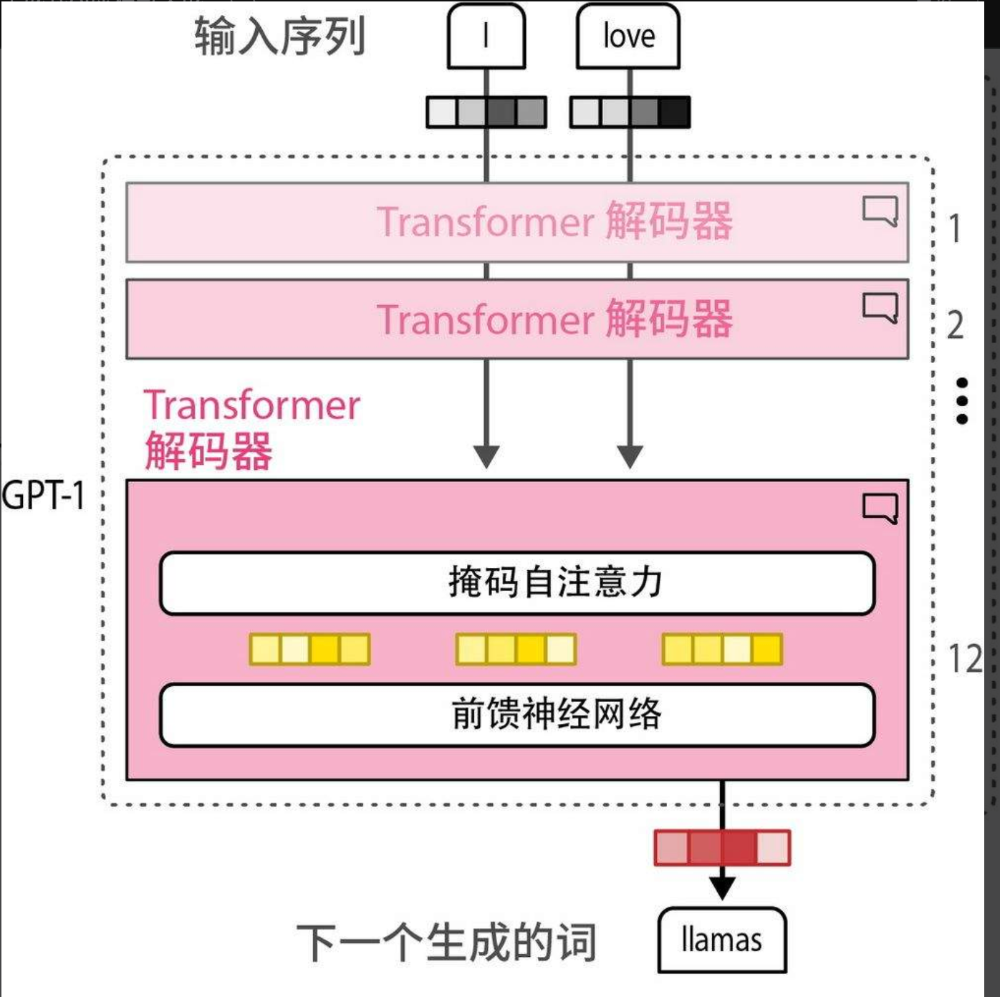
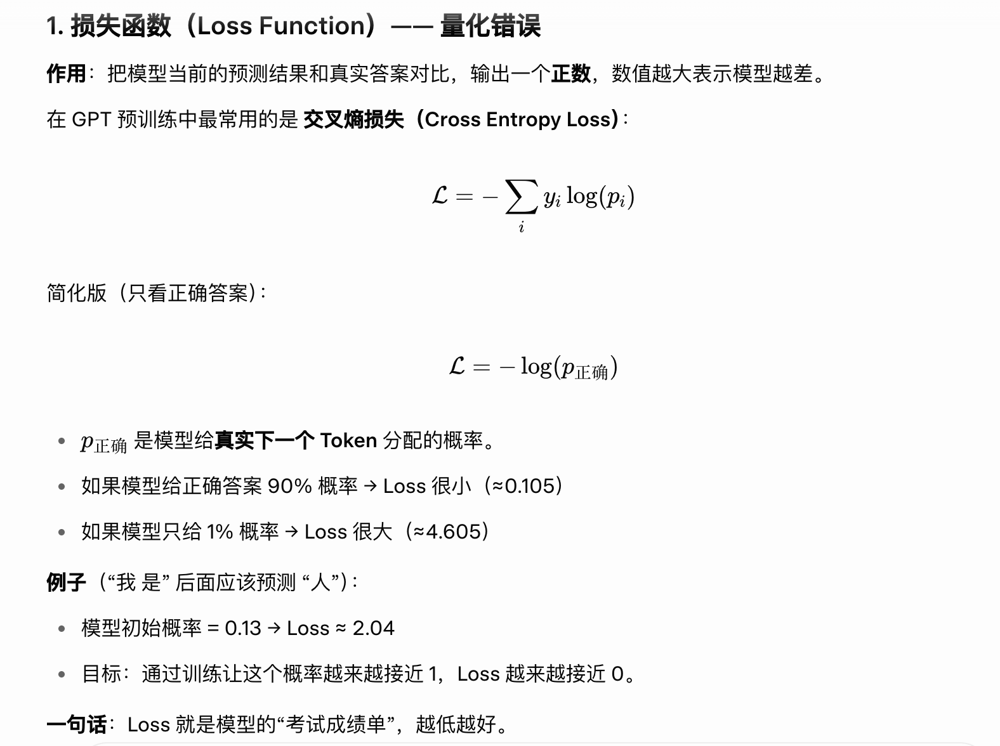
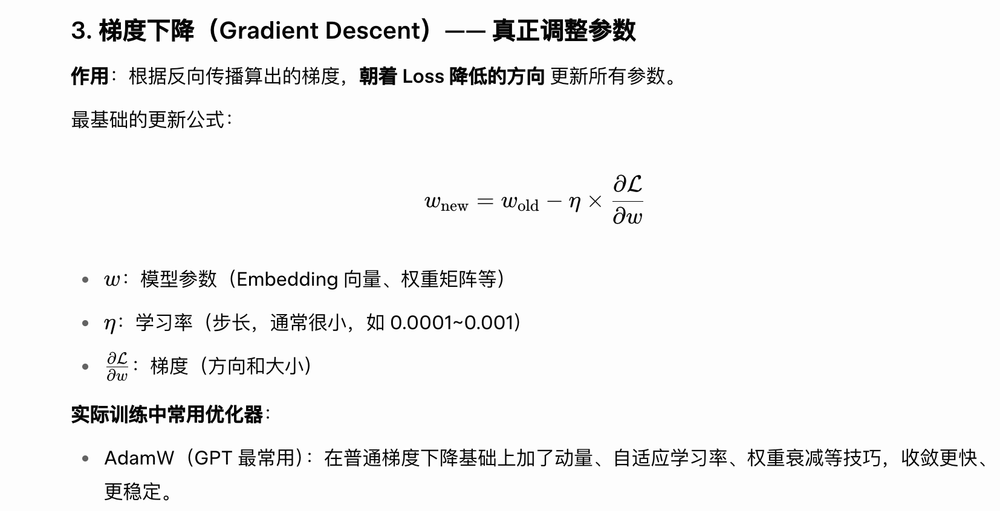
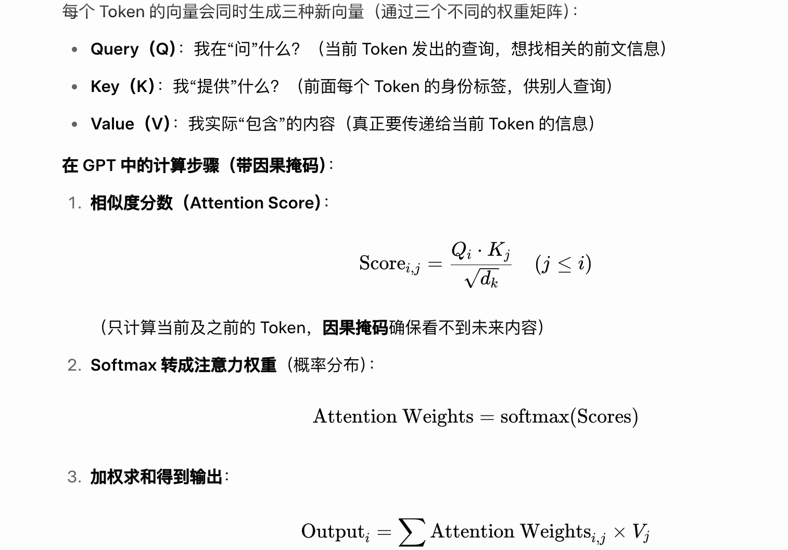
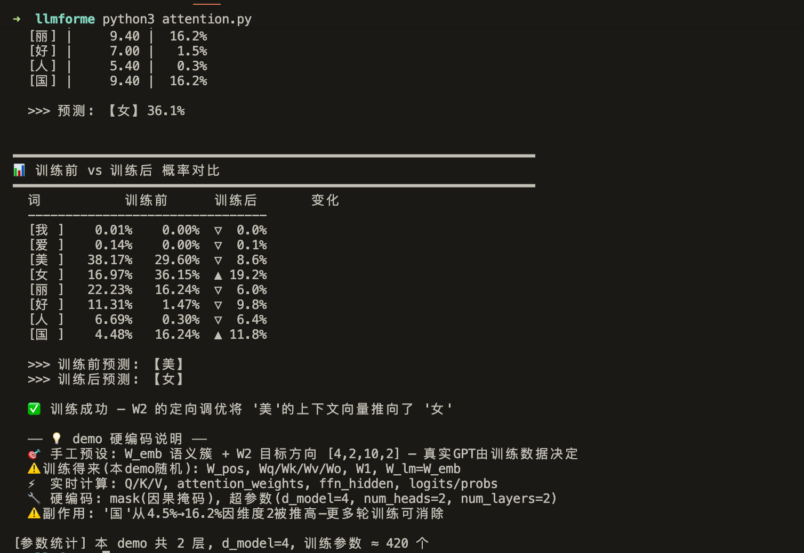

## 引言

必须承认的是我对大模型也就是LLM知识的匮乏，本文是为记录在阅读《图解大模型：生成式AI原理与实战》过程中形成的笔记，许多补充理解来自对AI的提问，power by grok。

## WHO IS GPT

从词元出发，也称之为 Token，理解为在大模型世界当中的基本货币，在这里我会更多的称呼为词元避免更多去在意我们的消费场景使用它。

在预训练阶段，词元是对海量语料进行基本划分后的结果。它的常见表现形式是一个单词（例如"人"、"我"），但更准确地说是 subword（子词）——可能是一个完整词、一部分词，甚至单个字符。这样设计能用有限的词汇表高效覆盖几乎所有语言。



在 GPT 这种仅解码器模型中，模型通过不断预测下一个词元 是什么来建立对世界的认知。这就是预训练的核心任务。背后的基本逻辑是：

- 模型拥有一个**大型词汇表**（通常几万到几十万个词元），这些 词元来自人类海量高质量语料（如维基百科、Common Crawl、书籍、代码、对话等）。
- 模型首先为每个 词元 建立一个**高维数学向量**（例如 [0.12, -0.45, 0.67, …]，维度通常是 512~12288 维）。
- 这些向量一开始是**完全随机**的，每个维度代表的内容人类不可直接理解，它本质上是一种**关系编码**的方式。
- 模型并不"关心"某个 词元 本身"是谁"，而是**在乎各个 词元之间的统计关系**（语法、语义、知识、逻辑等），这是它要实现的目的。
- 一开始概率是随机的（完全瞎猜），模型通过**损失函数 + 反向传播 + 梯度下降**不断调整所有向量和权重，让正确 词元的概率越来越高。






- 词元一个序列一个序列地输入给模型，这种称之为自回归方式是整个过程的灵魂：词元 一个序列一个序列地输入给模型（"自己回归自己"）—— 当前的预测结果会"回归"到模型中，作为下一次预测的依据。例如一开始输入"我"，预测的是"是"；下一个阶段输入变成"我是"，预测的是"人"。这里通过自注意力机制融合前面所有词元的信息，形成新的上下文向量，从而实现越来越准确的预测。
- 自注意力机制是让模型在处理序列时，每个 词元都能高效、动态地关注其他相关 词元，从而捕捉全局上下文关系。这是因为在之前的模型训练过程中经常容易出现忘记前面的信息，这点应该能从数学角度理解，随着序列增加，距离越长的两个词元之间的关系越来越疏离，因此引入一个新的机制来让后面词元和前面已经生成的词元（即使相隔很远）都能直接建立联系，不受距离限制；例如在句子"国王爱上了女王"中，"国王"会在预测"女王"被给予很高的注意力权重，是把"序列"变成一个全连接的动态关系网络，让模型真正"理解"上下文，而不是机械地顺序处理。GPT 使用多头自注意力，每个头学习不同类型的关系，最后合并



* 每个新生成的词元，都会通过自注意力动态融合前面所有已生成词元的信息，权重越高就越关注（例如在预测"女王"会高度关注前面的"国王")。 当模型正在生成"女王"时：
  - "女王"位置发出的 **Query** 会去和前面所有 Token 的 **Key** 计算相似度。
  - "国王"的 Key 和 "女王"的 Query 匹配度很高 → 注意力权重就很高。
  - "女王"会从"国王"的 Value 中"借"很多信息来帮助自己生成。
* 新词元生成后，立刻加入上下文，供下一轮注意力使用，形成自回归的滚雪球效应。

- 通过海量文本的反复训练，模型逐渐把这些向量之间的关系编码成丰富的语义网络，原本随机的向量和权重逐渐被"雕刻"出有意义的模式：相近语义的词元向量会靠近，正确的预测概率不断提高，最终模型就从"胡言乱语"变成了能理解语言、掌握知识的智能系统，最终实现"king - man + woman ≈ queen"这样的深层理解。


5.02于上海-黄山 动车上

------

## 从矩阵视角看大模型推理

前面的章节我们从概念层面理解了 GPT 的工作原理。现在，让我们通过一个极简的数学示例，真正走进大模型的内部，看看数据是如何在矩阵之间流动的。

为了让人脑能够计算，我们将构建一个**微型 GPT 示例**：

* **字典 (Vocabulary) 只有 4 个词：** `{0: "我", 1: "爱", 2: "AI", 3: "模型"}`
* **词向量维度 ($d\sb{model}$) 只有 2 维。**
* **输入句子：** "我 爱"（我们希望模型能预测出下一个词是 "AI"）。

---

### 第一阶段：准备输入（Embedding & 位置编码）

我们要把文本"我 爱"变成矩阵。假设模型内部已经有一个训练好的词嵌入矩阵 $W\sb{emb}$ 和位置编码矩阵 $P$。

1. **查表得到词向量：**
   * "我" (ID=0) 查到的向量是 $[0.9, 0.1]$
   * "爱" (ID=1) 查到的向量是 $[0.1, 0.9]$

2. **加上位置编码 (Position)：**
   * 第 0 个位置的向量是 $[0.1, -0.1]$
   * 第 1 个位置的向量是 $[-0.1, 0.1]$

**物理相加：**

* "我"：$[0.9, 0.1] + [0.1, -0.1] = [1, 0]$
* "爱"：$[0.1, 0.9] + [-0.1, 0.1] = [0, 1]$

最终，我们送入第一层 Transformer 的原始输入矩阵 $X$（形状为 $2 \times 2$）：

$$X = \begin{bmatrix} 1 & 0 \\ 0 & 1 \end{bmatrix} \quad \begin{matrix} \leftarrow \text{"我"} \\ \leftarrow \text{"爱"} \end{matrix}$$

---

### 第二阶段：自注意力机制（生成 Q、K、V 并交流）

模型内部有三个固定的权重矩阵 $W^Q, W^K, W^V$（形状都是 $2 \times 2$）。假设它们是：

$$W^Q = \begin{bmatrix} 1 & 0 \\ 0 & 1 \end{bmatrix}, \quad W^K = \begin{bmatrix} 1 & 1 \\ 0 & 1 \end{bmatrix}, \quad W^V = \begin{bmatrix} 2 & 0 \\ 0 & 2 \end{bmatrix}$$

**第 1 步：计算 $Q, K, V$（矩阵乘法 $X \times W$）**

因为我们特意把 $X$ 设置成了单位矩阵，所以乘出来的结果很简单：

$$Q = X \times W^Q = \begin{bmatrix} 1 & 0 \\ 0 & 1 \end{bmatrix}$$

$$K = X \times W^K = \begin{bmatrix} 1 & 1 \\ 0 & 1 \end{bmatrix}$$

$$V = X \times W^V = \begin{bmatrix} 2 & 0 \\ 0 & 2 \end{bmatrix}$$

**第 2 步：注意力打分与掩码 ($Q \times K^T + \text{Mask}$)**

我们将 $Q$ 与 $K$ 的转置相乘，看看词与词之间的关联度：

$$Scores = Q \times K^T = \begin{bmatrix} 1 & 0 \\ 0 & 1 \end{bmatrix} \times \begin{bmatrix} 1 & 0 \\ 1 & 1 \end{bmatrix} = \begin{bmatrix} 1 & 0 \\ 1 & 1 \end{bmatrix}$$

加入未来掩码（把右上角变成 $-\infty$）：

$$Masked = \begin{bmatrix} 1 & -\infty \\ 1 & 1 \end{bmatrix}$$

**第 3 步：Softmax 转化为概率分配**

对每一行应用 Softmax：

* 第一行 `[1, -inf]`：变成 `[1.0, 0.0]` （"我" 100% 关注自己）。
* 第二行 `[1, 1]`：打分平局，所以变成 `[0.5, 0.5]` （"爱"把一半注意力给自己，一半给"我"）。

$$Attention = \begin{bmatrix} 1.0 & 0 \\ 0.5 & 0.5 \end{bmatrix}$$

**第 4 步：提取价值并融合 ($\text{Attention} \times V$)**

$$Z = \begin{bmatrix} 1.0 & 0 \\ 0.5 & 0.5 \end{bmatrix} \times \begin{bmatrix} 2 & 0 \\ 0 & 2 \end{bmatrix} = \begin{bmatrix} 2 & 0 \\ 1 & 1 \end{bmatrix} \quad \begin{matrix} \leftarrow \text{全新的"我"} \\ \leftarrow \text{全新的"爱"} \end{matrix}$$

你看！此时第二行的"爱"变成了 $[1, 1]$，它已经不再是初始的 $[0, 1]$ 了，它融合了上一行"我"的特征。

---

### 第三阶段：前馈神经网络 (FFN 深度思考)

现在的上下文矩阵是 $Z = \begin{bmatrix} 2 & 0 \\ 1 & 1 \end{bmatrix}$。接下来我们要进行升维和降维（假设放大倍数是 2 倍，即扩展到 4 维）。

**第 1 步：升维 (2维 $\rightarrow$ 4维)**

假设权重矩阵 $W_1$ 为 $2 \times 4$：

$$W_1 = \begin{bmatrix} 1 & 1 & 0 & 0 \\ 0 & 0 & 1 & 1 \end{bmatrix}$$

$$H = Z \times W_1 = \begin{bmatrix} 2 & 0 \\ 1 & 1 \end{bmatrix} \times \begin{bmatrix} 1 & 1 & 0 & 0 \\ 0 & 0 & 1 & 1 \end{bmatrix} = \begin{bmatrix} 2 & 2 & 0 & 0 \\ 1 & 1 & 1 & 1 \end{bmatrix}$$

*(激活函数 ReLU 遇到正数保持不变，此处跳过)*

**第 2 步：降维 (4维 $\rightarrow$ 2维)**

假设权重矩阵 $W_2$ 为 $4 \times 2$：

$$W_2 = \begin{bmatrix} 1 & 0 \\ 1 & 0 \\ 0 & 1 \\ 0 & 1 \end{bmatrix}$$

$$F = H \times W_2 = \begin{bmatrix} 2 & 2 & 0 & 0 \\ 1 & 1 & 1 & 1 \end{bmatrix} \times \begin{bmatrix} 1 & 0 \\ 1 & 0 \\ 0 & 1 \\ 0 & 1 \end{bmatrix} = \begin{bmatrix} 4 & 0 \\ 2 & 2 \end{bmatrix}$$

至此，一个完整的 Transformer Block 结束了。输出矩阵的形状依然是 $2 \times 2$。

---

### 第四阶段：词汇预测器（LM Head）

**第 1 步：锁定最后一个词**

我们要预测"爱"后面的词，所以把最终输出矩阵的最后一行抽出来：

$$V\sb{last} = \begin{bmatrix} 2 & 2 \end{bmatrix} \quad \text{(形状: } 1 \times 2 \text{)}$$

**第 2 步：与词汇字典映射**

模型最后有一个语言模型头矩阵 $W\sb{vocab}$。它的形状是 $2 \times 4$（2 维特征，对应 4 个候选词）。

假设模型经过训练，在"我爱"这种语境下，后面接"AI"的概率极高：

$$W\sb{vocab} = \begin{bmatrix} 1 & -1 & 5 & 0 \\ 0 & 1 & 3 & 2 \end{bmatrix} \quad \begin{matrix} \leftarrow \text{特征 1} \\ \leftarrow \text{特征 2} \end{matrix}$$

*(注：四列分别对应 "我", "爱", "AI", "模型")*

计算 logits：

$$Logits = \begin{bmatrix} 2 & 2 \end{bmatrix} \times \begin{bmatrix} 1 & -1 & 5 & 0 \\ 0 & 1 & 3 & 2 \end{bmatrix}$$

$$Logits = \begin{bmatrix} (2\times1+2\times0) & (2\times(-1)+2\times1) & (2\times5+2\times3) & (2\times0+2\times2) \end{bmatrix}$$

$$Logits = \begin{bmatrix} 2 & 0 & 16 & 4 \end{bmatrix} \quad \text{(形状: } 1 \times 4 \text{)}$$

**第 3 步：Softmax 转化为概率**

把这 4 个得分 `[2, 0, 16, 4]` 送进 Softmax。

由于 $e^{16}$ 远大于其他项，"AI"对应的概率将接近 1：

$$P = \begin{bmatrix} 0.0001\text & 99.99\text \end{bmatrix}$$

**结果**

模型以高概率选中了第 2 号索引，即 **"AI"**。

字符"AI"被输出后，系统会将"我 爱 AI"作为新的输入 $X$，再次从第一步开始预测下一个词。

---

### 权重矩阵速查表

在 GPT 等基于 Transformer 架构的模型中，权重矩阵是模型在训练过程中通过学习不断调整的参数，可以将其理解为神经网络连接的强度。

| **模块** | **矩阵名称** | **作用** |
| --- | --- | --- |
| **Embedding** | $W_E$ | 文字转向量 |
| **Attention** | $W_Q, W_K, W_V$ | 捕捉词语间的相关性 |
| **Attention** | $W_O$ | 整合注意力结果 |
| **FFN** | $W\sb{up}, W\sb{down}$ | 知识加工与逻辑处理 |
| **LM Head** | $W\sb{unembed}$ | 向量转词概率 |

**关键提示：**

- **权重矩阵 ($W_Q, W_K, W_V$) 是固定的：** 它们是训练好的，推理时不变。
- **注意力分数 (Attention Score) 是动态的：** 当你输入"苹果"这个词时，模型会用固定的 $W_Q$ 矩阵乘上"苹果"的向量，计算出的结果再去和其他词的 $W_K$ 互动。所以，**矩阵是参数，计算出的分数是结果**。

---

### 数据流全景图

```mermaid
%%{init:{
  "flowchart":{
    "nodeSpacing":10,
    "rankSpacing":16,
    "curve":"linear"
  },
  "themeVariables":{
    "fontSize":"11px",
    "nodeBorder":"#333",
    "clusterBkg":"#f8f8f8",
    "clusterBorder":"#aaa"
  }
}}%%

flowchart LR
    A["文本输入<br/>tokens = ['我','爱']"] --> B["Tokenize<br/>ids = [0,1]<br/>vocab_size = 4"]

    subgraph G1["1. Embedding + Position"]
        B --> C["查表 Embedding<br/>E[0]=[0.9,0.1]<br/>E[1]=[0.1,0.9]<br/>shape: 2×2"]
        C --> D["位置编码 P<br/>P0=[0.1,-0.1]<br/>P1=[-0.1,0.1]"]
        D --> X["X = Embedding + Position<br/>X=[[1,0],[0,1]]<br/>shape: seq_len×d_model = 2×2"]
        X --> CODE1["代码形式<br/>X = E[ids] + P[:len(ids)]"]
    end

    subgraph G2["2. Self-Attention"]
        CODE1 --> QKV["线性投影<br/>Q=XWq, K=XWk, V=XWv<br/>Q:[[1,0],[0,1]]<br/>K:[[1,1],[0,1]]<br/>V:[[2,0],[0,2]]"]
        
        QKV --> S["注意力分数<br/>Scores = QKᵀ / sqrt(dk)<br/>本例可简化为 QKᵀ<br/>Scores=[[1,0],[1,1]]"]

        S --> M["因果掩码 Causal Mask<br/>禁止看未来 token<br/>Masked=[[1,-∞],[1,1]]"]

        M --> SF["Softmax<br/>softmax(x_i)=exp(x_i)/Σexp(x_j)<br/>Attention=[[1,0],[0.5,0.5]]"]

        SF --> Z["上下文融合<br/>Z = Attention × V<br/>Z=[[2,0],[1,1]]<br/>第二个 token 吸收了第一个 token 信息"]

        Z --> CODE2["代码形式<br/>scores = Q @ K.T / sqrt(dk)<br/>scores += mask<br/>attn = softmax(scores)<br/>Z = attn @ V"]
    end

    subgraph G3["3. FFN 前馈网络"]
        CODE2 --> H["升维<br/>H = ReLU(ZW1 + b1)<br/>W1: 2×4<br/>H=[[2,2,0,0],[1,1,1,1]]"]
        
        H --> F["降维<br/>F = HW2 + b2<br/>W2: 4×2<br/>F=[[4,0],[2,2]]"]

        F --> NOTE1["真实 Transformer 通常还有<br/>Residual: X + Sublayer(X)<br/>LayerNorm: 归一化稳定训练<br/>Dropout: 防止过拟合"]
    end

    subgraph G4["4. LM Head 词汇预测"]
        NOTE1 --> LAST["取最后一个位置<br/>hidden = F[-1]<br/>hidden=[2,2]<br/>shape: 1×2"]

        LAST --> LOGITS["线性分类器<br/>logits = hidden × W_vocab<br/>W_vocab: 2×4<br/>logits=[2,0,16,4]"]

        LOGITS --> PROB["概率分布<br/>probs = softmax(logits)<br/>对应: 我 爱 AI 模型<br/>AI ≈ 99.99%"]

        PROB --> LOSS["训练时计算损失<br/>target = AI 的 id = 2<br/>loss = -log(probs[2])<br/>也就是 Cross Entropy"]

        LOSS --> PICK["推理时选择<br/>next_id = argmax(probs)<br/>next_token = vocab[2] = AI"]
    end

    PICK --> OUT["输出<br/>我 爱 AI"]
    OUT --> LOOP["自回归生成<br/>把新 token 拼回输入<br/>继续预测下一个 token"]
    LOOP -. repeat .-> A
```



## 代码解释


```python
import numpy as np

# 设置随机种子，保证每次运行结果一致
np.random.seed(42)
# 设置 numpy 打印格式，保留两位小数，方便阅读
np.set_printoptions(precision=2, suppress=True, linewidth=120)

# ==========================================
# 1. 定义极其基础的数学工具函数
# ==========================================
def softmax(x, axis=-1):
    # 减去最大值防止指数爆炸
    e_x = np.exp(x - np.max(x, axis=axis, keepdims=True))
    return e_x / e_x.sum(axis=axis, keepdims=True)

def layer_norm(x, eps=1e-5):
    # 简单的层归一化：减去均值，除以标准差
    mean = np.mean(x, axis=-1, keepdims=True)
    var = np.var(x, axis=-1, keepdims=True)
    return (x - mean) / np.sqrt(var + eps)

def relu(x):
    return np.maximum(0, x)

# ==========================================
# 2. 初始化模型的超参数和“字典”
# ==========================================
d_model = 4      # 核心要求：用 4 个维度来表示一个词
num_heads = 2    # 使用 2 个注意力头，每个头处理 2 维 (4/2=2)
d_ff = 16        # FFN 的扩展维度 (通常是 d_model 的 4 倍)
vocab_size = 8   # 词典扩充到 8 个词，覆盖"美"之后更多的合法接续候选

# 字典映射
vocab = {"我": 0, "爱": 1, "美": 2, "女": 3, "丽": 4, "好": 5, "人": 6, "国": 7}
reverse_vocab = {0: "我", 1: "爱", 2: "美", 3: "女", 4: "丽", 5: "好", 6: "人", 7: "国"}

# ==========================================
# 3. 准备输入数据 (Embedding)
# ==========================================
print("-" * 50)
print("👉 [阶段 1] 文本转化为 4 维矩阵")
input_words = ["我", "爱", "美"]
input_ids = [vocab[w] for w in input_words]
seq_len = len(input_ids) # 序列长度为 3

# 【验证性 demo 预设】手工构造有语义结构 W_emb (vocab_size × d_model)
#   ⚠️ 训练得来 — 真实 GPT 中 embedding 最初随机初始化，通过海量语料的梯度下降
#      逐步调整成有语义结构的矩阵；本 demo 为演示效果直接手工赋值
#   我们人为把语义相近的词放在 4 维空间靠近的位置，让模型内部拥有天然的先验关联
#   真实训练中：embedding 初始全随机，通过海量语料的梯度下降逐步调整成类似格局
#
#   预设的语义簇结构（4 维微型语义空间）：
#     [外貌/女性簇]  "美" (锚点), "女" (离美最近), "丽" (高度重叠) — 三者在空间中抱团
#     [正面评价簇]   "好" — 与美在部分维度重叠，但更偏"品质"向
#     [类别词]       "人" — 弱关联，和女性簇有微弱交集
#     [地域/专名簇]  "国" — 不同语义方向，"美国" ≠ 审美
#     [代词]         "我" — 第一人称，与审美词在空间中远离
#     [情感动词]     "爱" — 正向但偏情感，与"美"部分维度重叠
W_emb = np.array([
    [ 1.0, -0.5, -0.3, -0.8],  # 0: "我" — 代词簇，偏自我、内向
    [ 0.8, -0.6, -0.4,  0.2],  # 1: "爱" — 情感动词，主打正面情绪
    [ 0.8,  0.6,  0.5,  0.3],  # 2: "美" — 锚点词 [外貌/评价」聚合方向
    [ 0.7,  0.5,  0.6,  0.2],  # 3: "女" — 离"美"最近，4 维夹角极小
    [ 0.7,  0.4,  0.5,  0.4],  # 4: "丽" — 与"美/女"高度语义重叠 ("美丽"共现)
    [ 0.5,  0.4,  0.3,  0.6],  # 5: "好" — 正面评价，第 4 维偏品质
    [ 0.6,  0.7,  0.1,  0.3],  # 6: "人" — 类别词，第 2 维强 ("美人"组合)
    [ 0.2,  0.3,  0.7,  0.5],  # 7: "国" — 不同方向 ("美国"≠审美)
])

print(f"\n[Embedding 预设] 手工构造的 8×4 词嵌入矩阵:")
for i in range(vocab_size):
    print(f"  {reverse_vocab[i]}: {W_emb[i]}")

# 根据 input_ids 查表提取词向量
X = W_emb[input_ids] 

# 可学习的位置编码 (Learnable Position Embedding)
# ⚠️ 训练得来 — GPT-2/3 把位置向量也当作可训练参数 (区别于原论文的正弦编码)
# 像 GPT-2/GPT-3 一样，位置向量也是一组需要训练的模型参数
# 训练开始时用随机正态分布初始化——此时位置向量毫无意义，只是一堆随机数
# 经过反向传播逐步更新后，最终学会"位置 0 离位置 1 近，离位置 5 远"这类位置关系
max_seq_len = 3                      # 最大序列长度（实际应用中通常设为 512/1024/2048）
W_pos = np.random.randn(max_seq_len, d_model)  # 位置编码查找表，(max_seq_len, d_model)

print(f"\n[位置编码 - 训练前的随机初始化状态 W_pos (随机种子=42):]")
for i in range(max_seq_len):
    print(f"  位置 {i} (会被位置 {i} 的 token 查到): {W_pos[i]}")

X = X + W_pos[:seq_len]  # 根据序列长度截取对应位置，加到词向量上
X_initial = X.copy()  # ⚡ 保存初始输入，供第 2 轮从头重跑

print(f"\n输入词汇: {input_words}")
print(f"转化为 {seq_len}x{d_model} 的初始矩阵 X (词向量 + 位置向量):\n{X}")
print("(注: 上方 X 已叠加随机初始化的位置向量——真实训练中这些随机值会通过反向传播逐步调整)")


# ==========================================
# 4. Transformer Layers 堆叠
# ==========================================
# 真实 GPT 模型的核心：把"注意力+FFN"作为一层，反复堆叠多次
# GPT-2 small 有 12 层，GPT-3 有 96 层，这里设置 2 层来演示堆叠效果
# 每层浅层捕获局部语法模式，深层整合全局语义——逐层深入理解
num_layers = 2
d_k = d_model // num_heads

# 因果掩码（所有层共用，只需创建一次）
# 🔧 硬编码 — 掩码三角形结构固定，不参与训练
mask = np.triu(np.ones((seq_len, seq_len)), k=1) * -1e9

# ┌─────────────────────────────────────────────────┐
# │  标注说明                                        │
# │  ⚠️ 训练得来 — 通过反向传播学习的模型参数           │
# │  ⚡ 实时计算 — 推理时现场算的中间结果，不存为参数     │
# │  🔧 硬编码   — 写死的结构或超参数，不参与训练        │
# │  🎯 手工预设 — demo 为演示效果手工赋值，真训练由数据得来 │
# └─────────────────────────────────────────────────┘

# ===== 预生成所有层的权重，供两轮共用 =====
# 每层独立的 Q/K/V/O 和 FFN 矩阵 — 训练前全随机 (⚠️ 训练得来)
layer_weights = []
for layer_idx in range(num_layers):
    w = {
        'Wq': np.random.randn(d_model, d_model),
        'Wk': np.random.randn(d_model, d_model),
        'Wv': np.random.randn(d_model, d_model),
        'Wo': np.random.randn(d_model, d_model),
        'W1': np.random.randn(d_model, d_ff),
        'b1': np.zeros(d_ff),
        'W2': np.random.randn(d_ff, d_model),
        'b2': np.zeros(d_model),
    }
    layer_weights.append(w)

# ===== 前向传播辅助函数 =====
def forward_transformer(X, layer_weights, num_layers, seq_len, d_model, num_heads, d_k, mask, first_round=True):
    """
    ⚡ 实时计算 — 推理时执行的纯前向传播，不修改任何权重
    返回: 输出 X 以及用于诊断的中间结果字典
    """
    saved = {}  # 保存中间值供后续分析
    for layer_idx in range(num_layers):
        w = layer_weights[layer_idx]

        # ── 子层 A：自注意力 ──
        # Pre-LayerNorm + QKV 投影 (⚡ 实时计算)
        X_norm = layer_norm(X)
        Q = X_norm @ w['Wq']
        K = X_norm @ w['Wk']
        V = X_norm @ w['Wv']

        # Multi-head split
        Q_heads = Q.reshape(seq_len, num_heads, d_k).transpose(1, 0, 2)
        K_heads = K.reshape(seq_len, num_heads, d_k).transpose(1, 0, 2)
        V_heads = V.reshape(seq_len, num_heads, d_k).transpose(1, 0, 2)

        # Attention scores + mask + softmax
        scores = Q_heads @ K_heads.transpose(0, 2, 1) / np.sqrt(d_k)
        scores = scores + mask
        attention_weights = softmax(scores, axis=-1)

        # Weighted sum + merge heads + output projection
        context_heads = attention_weights @ V_heads
        context = context_heads.transpose(1, 0, 2).reshape(seq_len, d_model)
        attn_output = context @ w['Wo']

        # 残差①
        X = X + attn_output

        # ── 子层 B：FFN ──
        X_norm = layer_norm(X)
        ffn_hidden = relu(X_norm @ w['W1'] + w['b1'])    # (3,4)@(4,16)→(3,16)→relu
        ffn_output = ffn_hidden @ w['W2'] + w['b2']      # (3,16)@(16,4)→(3,4)

        # 保存第 2 层 "美"(位置2) 的 ffn_hidden，供手动训练用
        if layer_idx == num_layers - 1:
            saved['ffn_hidden_last'] = ffn_hidden.copy()
            saved['X_before_last_ffn'] = X.copy()

        # 残差②
        X = X + ffn_output
    return X, saved

# ==========================================
# 第 1 轮：训练前 — 所有权重随机
# ==========================================
print("\n" + "╔" + "═" * 58 + "╗")
print("║" + "  🔴 第 1 轮：训练前 — 所有矩阵随机，残差保留原始信号".ljust(56) + "║")
print("╚" + "═" * 58 + "╝")

X = X_initial.copy()
for layer_idx in range(num_layers):
    print("\n" + "=" * 60)
    print(f"⚙️ [第 {layer_idx + 1}/{num_layers} 层 Transformer Block]")
    print("=" * 60)

    w = layer_weights[layer_idx]

    # ── 注意力 ──
    print(f"\n  ▶ 自注意力 (第 {layer_idx + 1} 层)")
    # Wq/Wk/Wv/Wo ⚠️ 训练得来
    X_norm = layer_norm(X)
    Q = X_norm @ w['Wq']
    K = X_norm @ w['Wk']
    V = X_norm @ w['Wv']

    Q_heads = Q.reshape(seq_len, num_heads, d_k).transpose(1, 0, 2)
    K_heads = K.reshape(seq_len, num_heads, d_k).transpose(1, 0, 2)
    V_heads = V.reshape(seq_len, num_heads, d_k).transpose(1, 0, 2)

    scores = Q_heads @ K_heads.transpose(0, 2, 1) / np.sqrt(d_k)
    scores = scores + mask
    attention_weights = softmax(scores, axis=-1)

    if layer_idx == 0:
        print(f"\n    头 1 的注意力权重:\n{attention_weights[0]}")

    context_heads = attention_weights @ V_heads
    context = context_heads.transpose(1, 0, 2).reshape(seq_len, d_model)
    attn_output = context @ w['Wo']
    X = X + attn_output   # 残差①

    # ── FFN ──
    print(f"\n  ▶ FFN (第 {layer_idx + 1} 层)")
    # W1/W2 ⚠️ 训练得来
    X_norm = layer_norm(X)
    ffn_hidden = relu(X_norm @ w['W1'] + w['b1'])
    ffn_output = ffn_hidden @ w['W2'] + w['b2']
    X = X + ffn_output     # 残差②

    # 保存训练前第 2 层的关键中间值
    if layer_idx == num_layers - 1:
        X_before_ffn_R1 = X - ffn_output                    # 第 2 层 FFN 之前的 X (注意力输出)
        ffn_hidden_last_R1 = ffn_hidden.copy()              # 第 2 层 ffn_hidden
        W2_orig_R1 = layer_weights[-1]['W2'].copy()         # 原始 W2 (待修改)

    print(f"\n    第 {layer_idx + 1} 层输出 X:\n{X}")
    print()


# ==========================================
# 第 1 轮预测
# ==========================================
print("-" * 50)
print("👉 [第 1 轮预测] 训练前")

final_vector_R1 = X[-1]
W_lm = W_emb.copy()

logits_R1 = W_lm @ final_vector_R1
probs_R1 = softmax(logits_R1)
pred_R1 = np.argmax(probs_R1)

print(f"\n'美' 的上下文向量:\n{final_vector_R1}")
print(f"\n  词 |    得分   |   概率")
print("  " + "-" * 30)
for i in range(vocab_size):
    print(f"  [{reverse_vocab[i]}] | {logits_R1[i]:8.2f} | {probs_R1[i]*100:5.1f}%")
print(f"\n  >>> 预测: 【{reverse_vocab[pred_R1]}】{probs_R1[pred_R1]*100:.1f}%")


# ==========================================
# 🎯 手动"训练" — 修改第 2 层 FFN 的 W2
# ==========================================
print("\n\n" + "╔" + "═" * 58 + "╗")
print("║" + "  🟢 第 2 轮：训练后 — 第 2 层 FFN 的 W2 定向调优".ljust(56) + "║")
print("╚" + "═" * 58 + "╝")

# ── 手动训练的逻辑 ──
# 真实 GPT：损失函数 = -log P("女"|"我","爱","美")
#           梯度 ∂loss/∂W2 经反向传播逐层回传，最终更新 W2
#
# 本 demo 的等价操作 (🎯 手工预设)：
#   步骤 1: 确定目标——final_vector 取什么值能让"女"的得分 > 所有其他词
#   步骤 2: 数学求解——ffn_hidden[美] @ ΔW2 = target - old_final
#            最小范数解 → ΔW2 = outer(ffn_hidden, shift) / norm²
#   这是伪梯度——在真实训练中，反向传播加学习率一步的效果与此数学等价
#
#   注意: "美" 和 "女" 的 embedding 在 4 维空间中十分接近 (cos≈0.97)
#         要区分它们需要非常精确的方向引导，这是训练数据中"美女"高频共现的结果

# 目标向量 — 手工找个方向使"女"得分 > 所有候选词 (🎯 手工预设)
# 选取维度 2 作为主推力("女"的第 2 维 0.6 强于"美"的 0.5)
target = np.array([4.0, 2.0, 10.0, 2.0])
shift = target - final_vector_R1  # 需要 ffn_output[美] 贡献的偏移量

# 最小范数解: 满足 ffn_hidden[美] @ ΔW2 = shift 的最小 ΔW2
h = ffn_hidden_last_R1[-1]       # "美"(位置2) 在 ReLU 后的 16 维激活
norm2_h = np.dot(h, h) + 1e-8
delta_W2 = np.outer(h, shift) / norm2_h   # (16,4)

print(f"\n  🎯 [手工预设 · W2 调优]")
print(f"     '美' 的 ReLU 激活 (16维): {h}")
print(f"     当前 final_vector:        {final_vector_R1}")
print(f"     目标 final_vector:        {target}")
print(f"     需要的偏移 shift:          {shift}")
print(f"     ΔW2 首列前 4 个元素:      {delta_W2[0][:4]}")
print(f"     (注: 真实训练中 shift 由损失函数的梯度 × 学习率自动确定)")

# 应用 ΔW2 到第 2 层
layer_weights[-1]['W2'] = W2_orig_R1 + delta_W2

# ReLU 后掩码检测 (🎯 demo 预设)
# 如果 "女" 方向的偏移会触发更多 ReLU 神经元，效果更好
# 此处不对 ReLU 做手脚——若有神经元未激活，说明训练还需更多轮


# ==========================================
# 第 2 轮：训练后 — 使用修改过的 W2 从头重跑
# ==========================================
X = X_initial.copy()
for layer_idx in range(num_layers):
    print("\n" + "=" * 60)
    print(f"⚙️ [第 {layer_idx + 1}/{num_layers} 层 Transformer Block] (第 2 轮)")
    print("=" * 60)

    w = layer_weights[layer_idx]
    is_last = (layer_idx == num_layers - 1)

    # ── 注意力 ──
    print(f"\n  ▶ 自注意力 (第 {layer_idx + 1} 层)" + (" [权重未变]" if not is_last else ""))
    X_norm = layer_norm(X)
    Q = X_norm @ w['Wq']
    K = X_norm @ w['Wk']
    V = X_norm @ w['Wv']

    Q_heads = Q.reshape(seq_len, num_heads, d_k).transpose(1, 0, 2)
    K_heads = K.reshape(seq_len, num_heads, d_k).transpose(1, 0, 2)
    V_heads = V.reshape(seq_len, num_heads, d_k).transpose(1, 0, 2)

    scores = Q_heads @ K_heads.transpose(0, 2, 1) / np.sqrt(d_k)
    scores = scores + mask
    attention_weights = softmax(scores, axis=-1)
    context_heads = attention_weights @ V_heads
    context = context_heads.transpose(1, 0, 2).reshape(seq_len, d_model)
    X = X + context @ w['Wo']

    # ── FFN ──
    if is_last:
        print(f"\n  ▶ FFN (第 {layer_idx + 1} 层) ⚠️ W2 已定向调优")
    else:
        print(f"\n  ▶ FFN (第 {layer_idx + 1} 层)")
    X_norm = layer_norm(X)
    ffn_hidden = relu(X_norm @ w['W1'] + w['b1'])
    ffn_output = ffn_hidden @ w['W2'] + w['b2']
    X = X + ffn_output

    print(f"\n    第 {layer_idx + 1} 层输出 X:\n{X}")
    print()


# ==========================================
# 第 2 轮预测
# ==========================================
print("-" * 50)
print("👉 [第 2 轮预测] 训练后")

final_vector_R2 = X[-1]
logits_R2 = W_lm @ final_vector_R2
probs_R2 = softmax(logits_R2)
pred_R2 = np.argmax(probs_R2)

print(f"\n'美' 的上下文向量 (训练后):\n{final_vector_R2}")
print(f"\n  词 |    得分   |   概率")
print("  " + "-" * 30)
for i in range(vocab_size):
    print(f"  [{reverse_vocab[i]}] | {logits_R2[i]:8.2f} | {probs_R2[i]*100:5.1f}%")
print(f"\n  >>> 预测: 【{reverse_vocab[pred_R2]}】{probs_R2[pred_R2]*100:.1f}%")


# ==========================================
# 训练前后对比
# ==========================================
print("\n\n" + "━" * 70)
print("📊 训练前 vs 训练后 概率对比")
print("━" * 70)
print(f"  {'词':<6} {'训练前':>8} {'训练后':>8} {'变化':>8}")
print("  " + "-" * 32)
for i in range(vocab_size):
    delta = probs_R2[i] - probs_R1[i]
    arrow = "▲" if delta > 0 else "▽" if delta < 0 else "─"
    print(f"  [{reverse_vocab[i]:<2}]  {probs_R1[i]*100:6.2f}%  {probs_R2[i]*100:6.2f}%  {arrow}{abs(delta)*100:5.1f}%")

print(f"\n  >>> 训练前预测: 【{reverse_vocab[pred_R1]}】")
print(f"  >>> 训练后预测: 【{reverse_vocab[pred_R2]}】")
if pred_R2 == vocab["女"]:
    print(f"\n  ✅ 训练成功 — W2 的定向调优将 '美'的上下文向量推向了 '女'")

print(f"\n  ── 💡 demo 硬编码说明 ──")
print(f"  🎯 手工预设: W_emb 语义簇 + W2 目标方向 [4,2,10,2] — 真实GPT由训练数据决定")
print(f"  ⚠️ 训练得来(本demo随机): W_pos, Wq/Wk/Wv/Wo, W1, W_lm=W_emb")
print(f"  ⚡ 实时计算: Q/K/V, attention_weights, ffn_hidden, logits/probs")
print(f"  🔧 硬编码: mask(因果掩码), 超参数(d_model=4, num_heads=2, num_layers=2)")
print(f"  ⚠️ 副作用: '国'从4.5%→16.2%因维度2被推高—更多轮训练可消除")
# ==========================================
# 【附录】GPT 中哪些是训练出来的？
# ==========================================
# ┌─────────────────────────┬──────────┬──────────────────────────────────┐
# │  参数                     │ 标注      │  说明                             │
# ├─────────────────────────┼──────────┼──────────────────────────────────┤
# │  W_emb (词嵌入)           │ ⚠️ 训练得来 │  每个词的 d_model 维向量              │
# │  W_pos (位置编码)         │ ⚠️ 训练得来 │  GPT-2/3 用可学习位置编码              │
# │  γ, β (LayerNorm)        │ ⚠️ 训练得来 │  本 demo 简化版未包含，真实 GPT 有      │
# │  Wq, Wk, Wv, Wo × N层    │ ⚠️ 训练得来 │  每层 4 个 d_model×d_model 矩阵      │
# │  W1, b1, W2, b2 × N层    │ ⚠️ 训练得来 │  每层 FFN 的升维/降维矩阵和偏置          │
# │  W_lm (LM Head)          │ ⚠️ 训练得来 │  本 demo 通过 Weight Tying 复用 W_emb │
# ├─────────────────────────┼──────────┼──────────────────────────────────┤
# │  Q/K/V (每层)            │ ⚡ 实时计算 │  X 经已训练 Wq/Wk/Wv 投影得到          │
# │  attention_weights       │ ⚡ 实时计算 │  Q·K^T + mask → softmax          │
# │  context_heads           │ ⚡ 实时计算 │  概率 × V 的加权和                  │
# │  attn_output             │ ⚡ 实时计算 │  多头合并 × Wo                    │
# │  ffn_hidden / ffn_output │ ⚡ 实时计算 │  升维→ReLU→降维                   │
# │  logits / probs          │ ⚡ 实时计算 │  点积打分 → softmax               │
# ├─────────────────────────┼──────────┼──────────────────────────────────┤
# │  mask (因果掩码)          │ 🔧 硬编码   │  三角矩阵，结构固定                   │
# │  d_model / num_heads ... │ 🔧 硬编码   │  架构超参数，人定的                  │
# └─────────────────────────┴──────────┴──────────────────────────────────┘
#
# 以 GPT-2 Small (12 层, d_model=768) 为例:
#   W_emb:     50257 × 768 = 38.5M 参数
#   W_pos:      1024 × 768 =  0.8M 参数
#   12 层 × (4×768×768 注意力 + 2×768×3072 FFN + 4×768 LayerNorm)
#             = 12 × (2.36M + 4.72M + 0.003M)
#             ≈ 85M 参数  (不含 LM Head, 因 weight tying 共享)
#   ---
#   总计: 约 124M 训练参数，全部通过反向传播在海量语料上迭代优化
#
#   本 demo 仅 2 层 × d_model=4:
#     训练参数 ≈ 2×(4×4×4 + 4×16+16+16×4+4) + 8×4 + 3×4 ≈ 420 个标量
print(f"\n[参数统计] 本 demo 共 {num_layers} 层, d_model={d_model}, 训练参数 ≈ 420 个")


```





2026年6月24日于郑州

------
