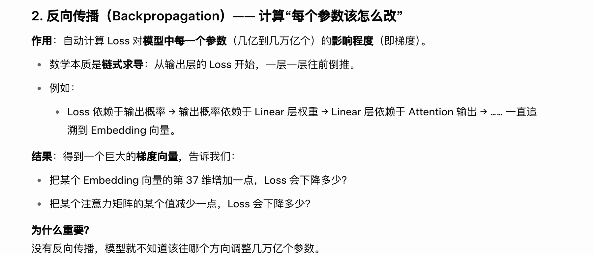
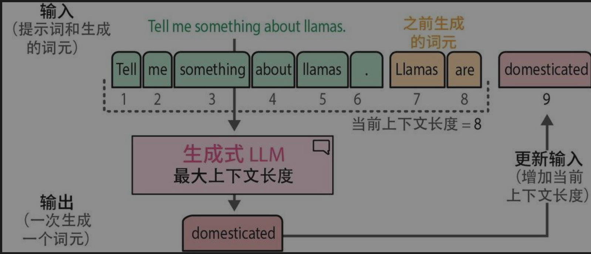

## 引言

​	必须承认的是我对大模型也就是LLM知识的匮乏，本文是为记录在阅读《图解大模型：生成式AI原理与实战》过程中形成的笔记，许多补充理解来自对AI的提问，power by grok。

## WHO IS GPT

​	从词元出发，也称之为 Token，理解为在大模型世界当中的基本货币，在这里我会更多的称呼为词元避免更多去在意我们的消费场景使用它。

​	在预训练阶段，词元是对海量语料进行基本划分后的结果。它的常见表现形式是一个单词（例如“人”、“我”），但更准确地说是 subword（子词）——可能是一个完整词、一部分词，甚至单个字符。这样设计能用有限的词汇表高效覆盖几乎所有语言。

​	在 GPT 这种仅解码器模型中，模型通过不断预测下一个词元 是什么来建立对世界的认知。这就是预训练的核心任务。背后的基本逻辑是：

- 模型拥有一个**大型词汇表**（通常几万到几十万个词元），这些 词元来自人类海量高质量语料（如维基百科、Common Crawl、书籍、代码、对话等）。
- 模型首先为每个 词元 建立一个**高维数学向量**（例如 [0.12, -0.45, 0.67, …]，维度通常是 512~12288 维）。
- 这些向量一开始是**完全随机**的，每个维度代表的内容人类不可直接理解，它本质上是一种**关系编码**的方式。
- 模型并不“关心”某个 词元 本身“是谁”，而是**在乎各个 词元之间的统计关系**（语法、语义、知识、逻辑等），这是它要实现的目的。
- 一开始概率是随机的（完全瞎猜），模型通过**损失函数 + 反向传播 + 梯度下降**不断调整所有向量和权重，让正确 词元的概率越来越高。

- 词元一个序列一个序列地输入给模型，这种称之为自回归方式是整个过程的灵魂：词元 一个序列一个序列地输入给模型（“自己回归自己”）—— 当前的预测结果会“回归”到模型中，作为下一次预测的依据。例如一开始输入“我”，预测的是“是”；下一个阶段输入变成“我是”，预测的是“人”。这里通过自注意力机制融合前面所有词元的信息，形成新的上下文向量，从而实现越来越准确的预测。
- 自注意力机制是让模型在处理序列时，每个 词元都能高效、动态地关注其他相关 词元，从而捕捉全局上下文关系。这是因为在之前的模型训练过程中经常容易出现忘记前面的信息，这点应该能从数学角度理解，随着序列增加，距离越长的两个词元之间的关系越来越疏离，因此引入一个新的机制来让后面词元和前面已经生成的词元（即使相隔很远）都能直接建立联系，不受距离限制；例如在句子“国王爱上了女王”中，“国王”会在预测“女王”被给予很高的注意力权重，是把“序列”变成一个全连接的动态关系网络，让模型真正“理解”上下文，而不是机械地顺序处理。GPT 使用多头自注意力，每个头学习不同类型的关系，最后合并

* 每个新生成的词元，都会通过自注意力动态融合前面所有已生成词元的信息，权重越高就越关注（例如在预测“女王”会高度关注前面的“国王”)。 当模型正在生成“女王”时：
  - “女王”位置发出的 **Query** 会去和前面所有 Token 的 **Key** 计算相似度。
  - “国王”的 Key 和 “女王”的 Query 匹配度很高 → 注意力权重就很高。
  - “女王”会从“国王”的 Value 中“借”很多信息来帮助自己生成。
* 新词元生成后，立刻加入上下文，供下一轮注意力使用，形成自回归的滚雪球效应。

- 通过海量文本的反复训练，模型逐渐把这些向量之间的关系编码成丰富的语义网络，原本随机的向量和权重逐渐被“雕刻”出有意义的模式：相近语义的词元向量会靠近，正确的预测概率不断提高，最终模型就从“胡言乱语”变成了能理解语言、掌握知识的智能系统，最终实现“king - man + woman ≈ queen”这样的深层理解。

  

​                    5.02于上海-黄山 动车上

------

