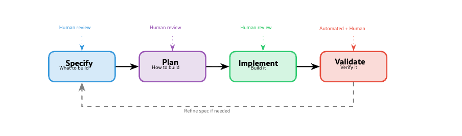
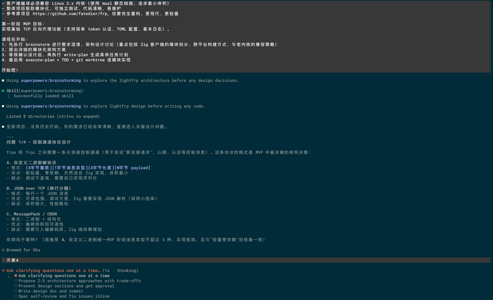
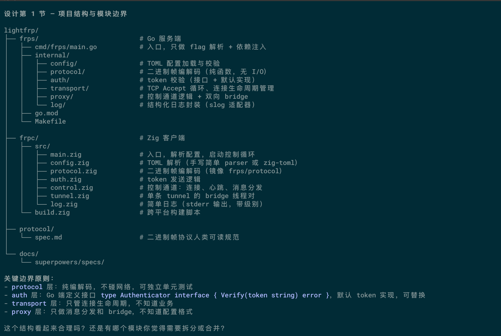
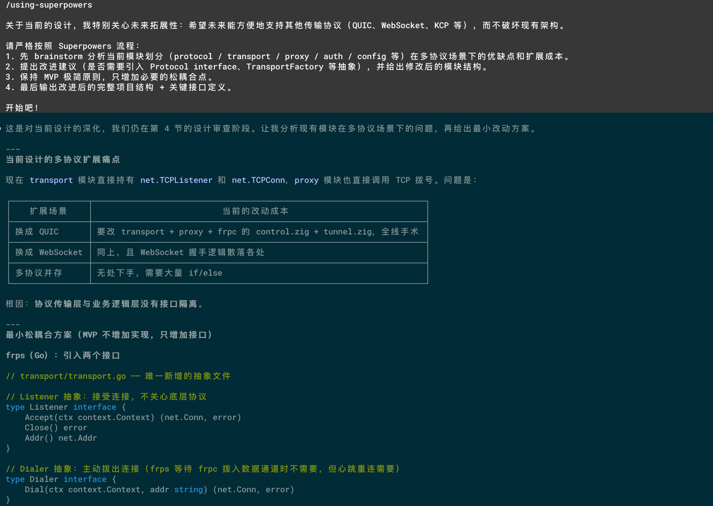
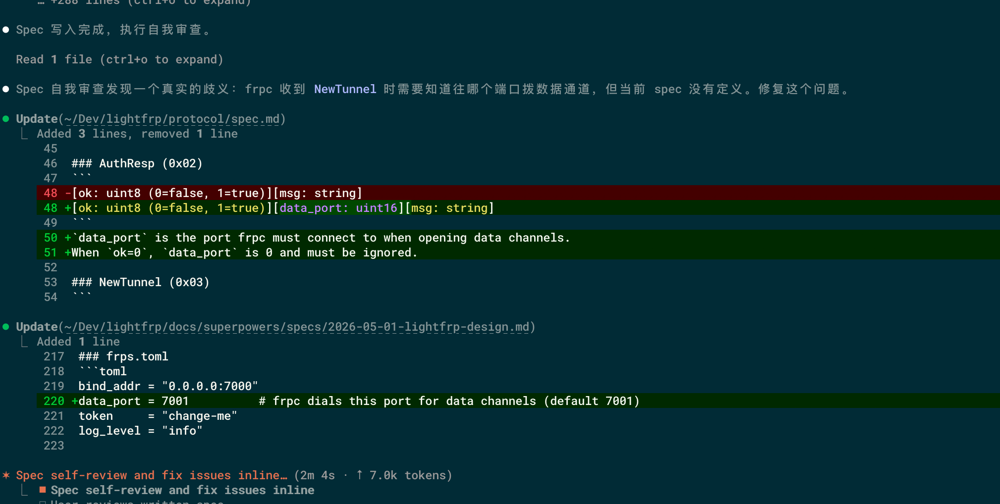
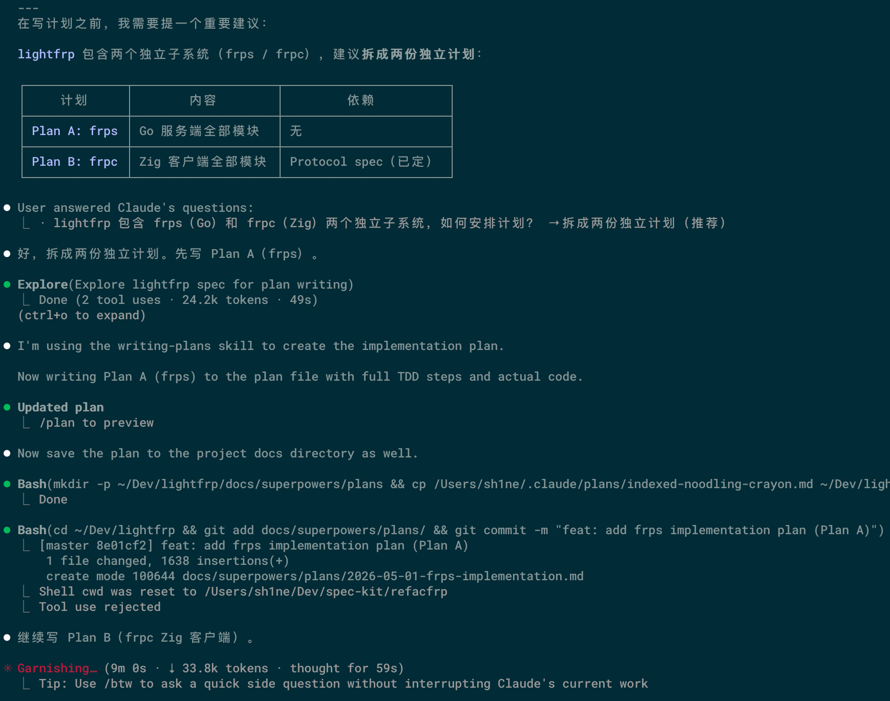
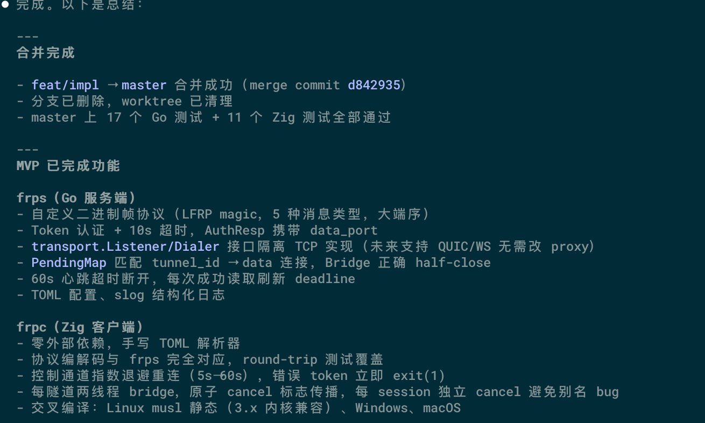
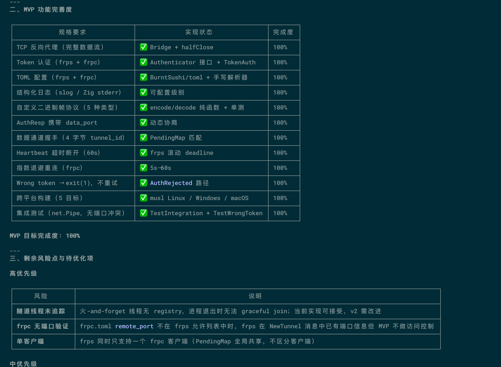
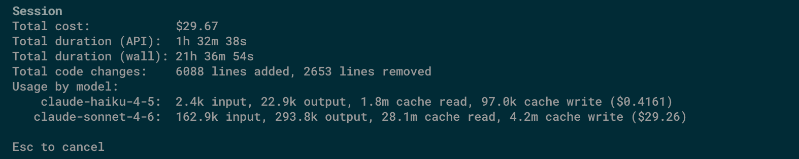

## 引言

> 人工智能编程助手的兴起重新激发了人们对一个旧理念的兴趣：如果规范而非代码才是软件开发的主要产物，会怎样？规范驱动开发（Spec-driven Development, SDD）颠覆了传统的工作流程，将规范视为唯一事实来源，而将代码作为生成或验证的次要产物。

​	Claude Code、Codex、OpenCode 等工程化 AI 编码工具的出现，让开发者从大量重复性编码劳动中解放出来。很多时候，我们不再需要亲手补全每一段样板代码，而是把更多精力放在需求拆解、系统边界、实现路径和质量验证上。

​	但这种变化也带来了新的问题。AI 编码工具擅长根据上下文生成“看起来合理”的代码，却不擅长猜测没有被明确表达的意图。当需求只停留在一句模糊的 prompt 里时，工具很容易自行补全假设：它可能选择了不符合项目约定的实现方式，绕开了已有的内部抽象，重复实现已经存在的能力，甚至在长任务中逐渐偏离最初目标。

​	这也是规范驱动开发重新变得重要的原因。SDD 试图把“我要什么”先明确下来，让规范成为人和 AI 共同遵循的事实来源。代码不再是唯一承载意图的地方，而是对规范的一次实现、生成或验证。对于 AI 辅助开发来说，规范本质上提供了更稳定的上下文、更清晰的边界和更可检查的完成标准。

​	这篇文章主要记录阅读《Spec-Driven Development: From Code to Contract in the Age of AI Coding Assistants》https://arxiv.org/html/2602.00180v1 这类文章后的结合践行SDD工作流程的实验。需要提前说一句：原文把 spec 描述为"唯一事实来源"——这个说法作为目标方向是合理的，但实践中并不完全成立。spec 是出发点和检查面，不是全程的权威；工程推进中，运行时行为会持续纠正 spec 的错误，杆子本身也会被校准。后面的实验结果会说明这一点。

## 从 spec-kit 到 superpowers

​	看 spec-kit 和 superpowers 时，我感觉它们其实是在解决同一个问题：如何让 AI 编码从“根据一句 prompt 直接写代码”，转向“围绕规范、计划、验证持续协作”。区别在于，spec-kit 更像是规范驱动开发的流程骨架，强调从需求到计划、从任务到验证的递进关系；superpowers 则更像是一套给 agent 使用的工程习惯，把澄清需求、编写计划、测试驱动、代码审查、分支收尾这些动作组织成可复用的 skills。

​	它们的核心思路并不是让模型更快地生成代码，而是先把开发过程中的关键判断显性化。需求阶段要说明“要做什么、为什么做、什么算完成”；计划阶段要把需求翻译成技术方案，明确会复用哪些已有能力、会修改哪些模块、有哪些风险；实现阶段再把计划拆成可以检查的小任务，而不是让模型一次性推进到底；验证阶段则要确认代码确实符合最初规范，而不是只停留在“代码看起来已经写完了”。

​	如果把这个流程压缩成几个步骤，大概可以理解为：先 specify，把模糊想法整理成可讨论的需求；再 plan，把需求变成可审查的技术路线；随后 implement 或 executing-plans，把路线拆成小步执行；过程中持续 analyze，检查当前进展是否偏离规范、是否出现新的风险；最后 verify 或 code review，用测试、构建、人工审查来确认实现结果。superpowers 里提到的 brainstorming、writing-plans、test-driven-development、requesting-code-review 等能力，本质上都是为了让这些步骤变成 agent 可以主动执行的行为。

​	这里面我觉得最关键的是持续 analyze。AI 辅助开发不是写好一次计划就万事大吉，长任务中模型会遗忘上下文，开发者也会在实现时发现新的约束。如果每完成一轮设计或实现，都能重新分析”已经完成了什么、哪里和规范不一致、下一步最该处理什么”，就可以把开发过程不断拉回到真实状态上，而不是沿着过期的假设继续走。

​	superpowers 把这个 analyze 动作拆成了两轮独立审查：一轮查”做没做”（spec compliance），一轮查”做好没好”（code quality）。分开看起来多余，但在实验中效果不一样。frp 实验里，spec-reviewer 发现了 PendingMap 超时后清理逻辑的遗漏——这是功能完整性问题，和代码写得好不好无关；code-quality-reviewer 发现了 context 传播缺失和 goroutine 生命周期管理问题——这是健壮性问题，spec 里没有明确要求。如果两轮合并成一轮，审查者很难同时持有这两个视角，实际上会更容易漏其中一类。

​	两者结合起来，实际上是在回答同一个问题：如何把 AI 从”会写代码的助手”，推进到”能在约束下协作完成工程任务的成员”。AI 编码的关键能力不只是生成代码，而是能否稳定执行一套可靠的软件工程流程——spec-kit 提供流程骨架，superpowers 把这套骨架变成 agent 可以主动执行的习惯。

​	如果想继续了解这套思路，可以看几个相关网站：

- spec-kit：https://github.com/github/spec-kit
- superpowers：https://github.com/obra/superpowers
- Builder.io 对 Claude Code Superpowers Plugin 的介绍：https://www.builder.io/blog/claude-code-superpowers-plugin
- Namiru 的 Superpowers Plugin 教程：https://namiru.ai/blog/superpowers-plugin-for-claude-code-the-complete-tutorial

## Refactor Frp

​	为了不让前面的内容只停留在“听起来很有道理”的层面，我找了一个更接近真实开发的场景做实验：重构一个简化版 Frp。Frp 本身是一款很成熟的内网穿透工具，我这里当然不是准备手搓一个生产级替代品，而是借这个题目观察一件事：如果把目标、边界和实现要求尽量写进 spec，让 AI 按规范驱动的方式推进，它到底能把一个模块化、轻量级的项目设计做到什么程度。

​	这次实验我使用 Claude Code，并安装了 superpowers 插件。这样做的目的不是为了证明某个插件有多神，而是想看看当 agent 被一套更明确的流程约束住以后，它会不会少一点“上来就开写”的冲动。毕竟 AI 写代码最容易出现的场景就是：需求还没问清楚，文件已经改了五个；你还在想架构，它已经开始热心地帮你造轮子。

​	提交初始需求后，superpowers 并没有马上进入编码，而是先从描述中提取关键信息，并通过一组交互式问题继续澄清需求。这个体验和普通 prompt 最大的区别在于，它会主动把模糊点拎出来问你：目标是什么，哪些能力必须做，哪些暂时不做，项目结构希望怎么组织，未来是否需要扩展。这个过程有点像被一个很认真但有点较真的同事拉住开需求评审会：略慢，但能明显减少后面“你怎么做成这样”的尴尬。

​	在这个过程中，如果自己的想法发生变化，也可以继续补充需求。比如我一开始只想做一个最小可用的转发模型，但聊到中途又觉得未来可能要支持其他协议，于是需要在设计上预留扩展空间。这时候可以再次调用 `/using-superpowers`，让 agent 重新分析当前需求，并把新的约束合并进设计里。这个步骤很重要，因为真实开发里需求变化不是异常，而是日常；区别只在于，有些变化被及时写进规范，有些变化则悄悄变成了后期返工。

​	等需求逐渐收敛后，就可以让 Claude 判断当前是否已经达到进入 `writing-plan` 阶段的条件。这个信号本质上是在确认：需求已经足够清楚，可以从“讨论想法”进入“沉淀计划”。随后它会把前面在对话中形成的设计写入磁盘，变成一个可以反复查看、修改和审查的计划文件。换句话说，计划不再只是聊天窗口里的临时上下文，而是变成了项目的一部分。

​	写入计划后，superpowers 还会推动 Claude 做一次自我审查：当前计划是否遗漏关键任务，任务之间是否有依赖关系，是否存在无法验证的实现目标，是否需要补充测试。至少它会强迫模型回头看一遍刚才的推理，而不是一路自信地冲到实现阶段。

	

​	流程本身并不会让 AI 突然变聪明，但会让它更不容易失控。spec 和 plan 像是给 agent 搭了一套脚手架，superpowers 则不断提醒它不要抄近路、不要跳步骤、不要把”我觉得差不多了”当成完成标准。脚手架和轨道不一样：轨道是预先铺好的，跟着走就行；脚手架在施工中会不断被调整加固——实验里 18 个 Task 有 7 处偏差通过审查被修正，其中 3 处是架构级调整，spec 本身就有遗漏，是流程制造的检查点让它们暴露出来。

​	这次实验最终的结果：26 项单元测试全部通过，5 个端到端场景全部通过，4 个跨平台编译目标全部成功。这些数字不是为了说明”成功率有多高”，而是在说：流程本身制造了检查点，让问题有机会在变贵之前暴露。

​	当然，这套方式也有成本。小需求会显得有点重，简单改个文案也开需求评审就多少有些隆重。但一旦任务涉及架构、模块边界或长期维护，这种”先慢一点”的流程反而能省掉后面很多补锅时间。

最终的交付结果 https://github.com/ElectQ/lightfrp 。

太烧token了也是。

## 结语

​	SDD 的核心价值不是让规范替代代码，而是让"我要什么"在被写成代码之前先被写清楚，让 AI 有一个可以对照的检查面，而不只是一个模糊的 prompt 去自由发挥。这套流程在这次实验里确实有效——但它有两类问题接不住，值得说一下。

​	第一类是只有运行才能发现的 bug。实验里出现过两个具体案例：Zig 的值语义导致两个线程共享同一个底层文件描述符，两次 close 触发了 panic；以及 Bridge 函数在第一个数据方向完成后就关闭了连接，截断了 echo 回程的数据。这两个 bug，spec 写得再细也查不出来，因为文本描述的是意图，覆盖不了语言运行时的行为。补救方式不是把 spec 写得更详细，而是在流程里强制插入一次真实的冒烟运行（最基本的、快速的验证测试）。

​	第二类是跨模块的系统级不变量。实验里有个具体案例：客户端的连接控制模块和隧道桥接模块分别通过了各自的 spec 审查和代码质量审查。但当两个模块合在一起跑时，出现了一个并发竞态——控制模块在断线重连时会重置一个全局取消标志，而上一个 session 的隧道线程还持有这个标志的指针，结果新 session 的"取消"信号被旧线程悄悄读走了。任何一个模块的单独审查都不会发现这个问题，因为问题在两个模块的交界处。这说明规范的粒度有下限：模块级的规范无法完整覆盖模块之间的时序约束，某些不变量只在系统级才可见。

​	这不是 SDD 的失败，是它的边界。知道边界在哪，才能在边界外补别的手段。更长远地看，SDD 能做到的是把 AI 和开发者的协作从"一次性的 prompt 赌注"变成"有检查面的持续过程"；它做不到的，不应该期待它做到——但也不用因此否定它。

​	

​     
